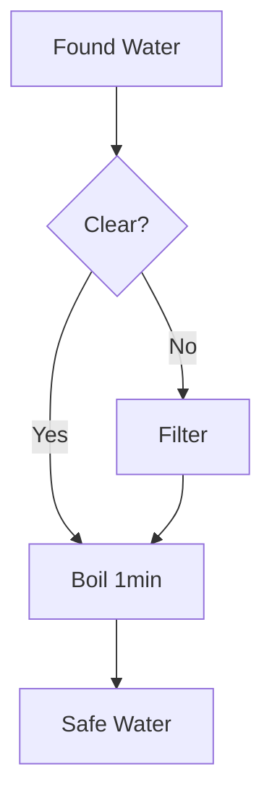

# Mermaid Diagram Templates

This directory contains Mermaid diagram templates for use with the MERMAID command in uDOS.

## Available Templates

### flowchart_template.mmd
Flowchart and process diagram template with decision points, actions, and various node shapes.

**Use cases:**
- Decision trees
- Process flows
- Workflows
- Algorithm logic

**Example:**
```bash
MERMAID TEMPLATE flowchart
MERMAID RENDER flowchart water_purification_flow.mmd
```

### sequence_template.mmd
Sequence diagram template for interactions between participants.

**Use cases:**
- Communication flows
- API interactions
- Protocol descriptions
- System interactions

**Example:**
```bash
MERMAID TEMPLATE sequence
MERMAID RENDER sequence fire_starting_sequence.mmd
```

### mindmap_template.mmd
Mind map template for hierarchical concept organization.

**Use cases:**
- Brainstorming
- Knowledge mapping
- Planning
- Concept organization

**Example:**
```bash
MERMAID TEMPLATE mindmap
MERMAID RENDER mindmap survival_priorities.mmd
```

## Creating Custom Templates

1. Create a `.mmd` file in this directory
2. Name it: `<diagram_type>_template.mmd`
3. Add Mermaid syntax with comments explaining usage
4. Test: `MERMAID RENDER <type> <template_file>`

## Diagram Type Reference

See full documentation: https://mermaid.js.org/

**Supported types:**
- flowchart - Process and flow diagrams
- sequence - Interaction diagrams
- gantt - Project timelines
- class - UML class diagrams
- state - State machines
- pie - Pie charts
- gitgraph - Git branching
- mindmap - Mind maps
- timeline - Timeline diagrams
- quadrant - Priority matrices
- sankey - Flow diagrams
- xychart - Data charts

## Integration with Knowledge Guides

Templates can be embedded in knowledge guides using Mermaid code blocks:

```markdown
# Water Purification Process


```

The GUIDE system will automatically render these diagrams when displaying guides.

## Version

Template library version: 1.1.15
Last updated: December 2, 2025
