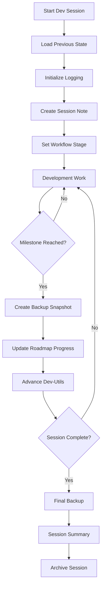

# uDOS Wizard Development Framework
*Notes, Workflows, and Roadmap Management with Smart Backup Integration*

## Overview

The uDOS Wizard Development Framework provides a structured approach to managing development notes, workflows, roadmaps, and utilities with full integration to the smart backup system for comprehensive undo/redo capabilities.

## Framework Architecture

### 1. Development Lifecycle Integration

```
┌─────────────────────────────────────────────────────────────┐
│ WIZARD DEVELOPMENT FRAMEWORK                                 │
├─────────────────────────────────────────────────────────────┤
│                                                             │
│ ┌─────────────┐  ┌─────────────┐  ┌─────────────┐          │
│ │   NOTES     │  │ WORKFLOWS   │  │  ROADMAPS   │          │
│ │  SYSTEM     │◄─┤   ENGINE    │◄─┤  MANAGER    │          │
│ └─────────────┘  └─────────────┘  └─────────────┘          │
│        │                │                │                 │
│        ▼                ▼                ▼                 │
│ ┌─────────────────────────────────────────────────────────┐ │
│ │           SMART BACKUP INTEGRATION                      │ │
│ │  ┌───────────┐  ┌───────────┐  ┌───────────┐          │ │
│ │  │ SNAPSHOT  │  │  DELTA    │  │ RECOVERY  │          │ │
│ │  │  SYSTEM   │  │ TRACKING  │  │  ENGINE   │          │ │
│ │  └───────────┘  └───────────┘  └───────────┘          │ │
│ └─────────────────────────────────────────────────────────┘ │
│        │                │                │                 │
│        ▼                ▼                ▼                 │
│ ┌─────────────────────────────────────────────────────────┐ │
│ │              DEV-UTILS ADVANCEMENT                      │ │
│ │  Analytics │ Optimization │ Automation │ Integration    │ │
│ └─────────────────────────────────────────────────────────┘ │
└─────────────────────────────────────────────────────────────┘
```

### 2. Notes System Architecture

#### 2.1 Note Types & Classification
```
wizard/notes/
├── development/           # Development-specific notes
│   ├── session-YYYYMMDD-{hex}.md     # Session notes with backup points
│   ├── feature-{name}-{hex}.md       # Feature development notes
│   ├── bug-{id}-{hex}.md             # Bug tracking and resolution
│   └── research-{topic}-{hex}.md     # Research and exploration
├── workflows/             # Workflow documentation
│   ├── active/           # Currently active workflows
│   ├── templates/        # Workflow templates
│   └── archived/         # Completed workflows
├── roadmaps/             # Strategic planning
│   ├── quarterly/        # Quarterly roadmaps
│   ├── sprint/           # Sprint planning
│   └── long-term/        # Long-term vision
└── snapshots/            # Backup integration points
    ├── auto/             # Automatic snapshots
    └── manual/           # Manual checkpoint snapshots
```

#### 2.2 Note Metadata Structure
```yaml
---
type: [session|feature|bug|research|workflow|roadmap]
created: YYYY-MM-DD HH:MM:SS
session_id: WIZ_YYYYMMDD_HHMMSS_{hex}
backup_point: {hex-id}
tags: [tag1, tag2, tag3]
priority: [low|medium|high|critical]
status: [draft|active|review|complete|archived]
related_files: [file1, file2, file3]
backup_snapshot: {snapshot-id}
workflow_stage: {stage-name}
---
```

### 3. Workflow Engine

#### 3.1 Workflow Definition Schema
```yaml
# wizard/workflows/templates/development-workflow.yml
workflow:
  name: "Feature Development Workflow"
  version: "1.0"
  backup_integration: true
  
  stages:
    - name: "planning"
      backup_trigger: "stage_start"
      required_notes: ["requirements", "design"]
      outputs: ["plan.md", "architecture.md"]
      
    - name: "implementation"
      backup_trigger: "milestone"
      required_files: ["src/"]
      checkpoints: ["feature_complete", "tests_pass"]
      
    - name: "testing"
      backup_trigger: "test_results"
      required_outputs: ["test_report.md"]
      validation: ["unit_tests", "integration_tests"]
      
    - name: "documentation"
      backup_trigger: "docs_complete"
      required_outputs: ["README.md", "API.md"]
      
    - name: "deployment"
      backup_trigger: "deploy_ready"
      final_snapshot: true

  backup_policy:
    auto_snapshot: ["stage_transition", "milestone_reached"]
    retention: "30_days"
    compression: true
```

#### 3.2 Workflow State Management
```bash
# wizard/workflows/active/current-workflow.state
{
  "workflow_id": "DEV_20250821_014732_A3F9",
  "current_stage": "implementation",
  "stage_progress": 0.75,
  "backup_points": [
    {
      "stage": "planning",
      "timestamp": "2025-08-21T01:47:32Z",
      "snapshot_id": "SNAP_A3F9_PLAN_001",
      "files_changed": 3
    }
  ],
  "next_checkpoint": "feature_complete",
  "estimated_completion": "2025-08-21T18:00:00Z"
}
```

### 4. Roadmap Management System

#### 4.1 Roadmap Hierarchy
```
Roadmaps/
├── Vision/               # Long-term strategic vision
│   ├── 2025-goals.md
│   └── 2026-outlook.md
├── Quarterly/            # Quarterly planning
│   ├── Q3-2025.md
│   └── Q4-2025.md
├── Sprint/               # Sprint-level planning
│   ├── current-sprint.md
│   └── next-sprint.md
└── Daily/                # Daily objectives
    └── YYYY-MM-DD.md
```

#### 4.2 Roadmap-Workflow Integration
```yaml
# Roadmap item with workflow integration
roadmap_item:
  id: "FEAT_001"
  title: "Enhanced Error Handling"
  priority: "high"
  estimated_effort: "5 days"
  
  workflow_template: "feature-development"
  backup_strategy: "milestone_based"
  
  dependencies:
    - "FEAT_000_logging_system"
  
  deliverables:
    - "Error handling framework"
    - "Role-themed error handlers"
    - "Integration tests"
    - "Documentation"
  
  success_criteria:
    - "All error handlers operational"
    - "Test coverage > 90%"
    - "Documentation complete"
```

### 5. Smart Backup Integration

#### 5.1 Backup Trigger Points
```bash
# Automatic backup triggers in development workflow
BACKUP_TRIGGERS=(
    "workflow_stage_start"     # Beginning of each workflow stage
    "milestone_reached"        # Key development milestones
    "significant_change"       # Major code or design changes
    "test_completion"          # After running test suites
    "documentation_update"     # Documentation changes
    "daily_checkpoint"         # End of development day
    "manual_request"           # Developer-initiated backup
)
```

#### 5.2 Backup Metadata for Development
```json
{
  "backup_id": "DEV_20250821_014732_B7E4",
  "type": "workflow_milestone",
  "workflow_context": {
    "workflow_id": "DEV_20250821_014732_A3F9",
    "stage": "implementation",
    "milestone": "feature_complete",
    "notes_included": ["session-20250821-A3F9.md", "feature-error-handling-B7E4.md"]
  },
  "dev_utils_state": {
    "analytics_data": "included",
    "optimization_settings": "included",
    "automation_scripts": "versioned"
  },
  "recovery_instructions": {
    "workflow_stage": "implementation",
    "next_steps": ["run_tests", "update_docs"],
    "dependencies": ["error_handlers_complete"]
  }
}
```

### 6. Dev-Utils Advancement Framework

#### 6.1 Utility Categories
```
wizard/dev-utils/
├── analytics/            # Development analytics tools
│   ├── session-tracker.sh      # Track development sessions
│   ├── productivity-metrics.sh # Measure development productivity
│   └── workflow-analyzer.sh    # Analyze workflow efficiency
├── optimization/         # Performance optimization tools
│   ├── code-profiler.sh        # Profile code performance
│   ├── backup-optimizer.sh     # Optimize backup operations
│   └── workflow-optimizer.sh   # Optimize workflow stages
├── automation/           # Development automation
│   ├── auto-tester.sh          # Automatic testing
│   ├── doc-generator.sh        # Auto-generate documentation
│   └── deployment-helper.sh    # Deployment automation
└── integration/          # Integration utilities
    ├── git-integration.sh      # Git workflow integration
    ├── backup-sync.sh          # Sync with backup system
    └── workflow-bridge.sh      # Bridge workflows and tools
```

#### 6.2 Advancement Tracking
```yaml
# wizard/dev-utils/advancement-tracker.yml
advancement:
  version: "1.3.0"
  last_update: "2025-08-21T01:47:32Z"
  
  utilities:
    analytics:
      session_tracker:
        version: "2.1"
        features: ["real_time_tracking", "session_correlation"]
        next_advancement: "predictive_analytics"
        
    optimization:
      backup_optimizer:
        version: "1.5"
        features: ["delta_compression", "selective_backup"]
        next_advancement: "ml_optimization"
        
    automation:
      workflow_automation:
        version: "3.0"
        features: ["stage_automation", "checkpoint_triggers"]
        next_advancement: "ai_assisted_workflows"
```

### 7. Workflow Implementation

#### 7.1 Development Session Workflow


#### 7.2 Undo/Redo with Smart Backup
```bash
# Development undo/redo operations
wizard_undo() {
    local target_backup="$1"
    
    # Get current workflow state
    local current_workflow=$(get_current_workflow)
    
    # Create safety backup before undo
    create_safety_backup "before_undo_$(date +%s)"
    
    # Restore from backup
    restore_from_backup "$target_backup"
    
    # Update workflow state
    update_workflow_state "$current_workflow" "restored_from_$target_backup"
    
    # Update notes with undo information
    create_undo_note "$target_backup" "$(date)"
}

wizard_redo() {
    local target_state="$1"
    
    # Similar process but moving forward
    create_safety_backup "before_redo_$(date +%s)"
    advance_to_state "$target_state"
    update_workflow_state "advanced_to_$target_state"
    create_redo_note "$target_state" "$(date)"
}
```

### 8. Integration Points

#### 8.1 VS Code Integration
```json
// .vscode/tasks.json additions for workflow management
{
    "label": "📝 Create Development Note",
    "type": "shell",
    "command": "./dev-utils.sh",
    "args": ["create_note", "${input:noteType}", "${input:noteTitle}"]
},
{
    "label": "🔄 Advance Workflow",
    "type": "shell", 
    "command": "./dev-utils.sh",
    "args": ["advance_workflow", "${input:targetStage}"]
},
{
    "label": "💾 Manual Backup Checkpoint",
    "type": "shell",
    "command": "./dev-utils.sh", 
    "args": ["create_checkpoint", "${input:checkpointName}"]
}
```

#### 8.2 uDOS Integration
```bash
# Integration with existing uDOS systems
source "../../uCORE/code/backup-restore.sh"
source "../../uMEMORY/core/session-manager.sh"
source "../error-handling/wizard-dev-logging.sh"

# Framework initialization
init_dev_framework() {
    setup_note_system
    initialize_workflow_engine
    configure_backup_integration
    start_dev_utils_advancement
}
```

## Benefits

1. **Structured Development**: Clear workflow stages with automatic documentation
2. **Comprehensive Backup**: Every development step is backed up and recoverable
3. **Advancement Tracking**: Dev-utils evolve based on usage patterns and needs
4. **Integration**: Seamless integration with existing uDOS systems
5. **Productivity**: Automated workflows reduce manual overhead
6. **Recovery**: Complete undo/redo capabilities at any granularity
7. **Analytics**: Data-driven insights into development patterns and efficiency

This framework provides a complete development environment that grows and adapts with the developer while maintaining full backup integrity and recovery capabilities.
