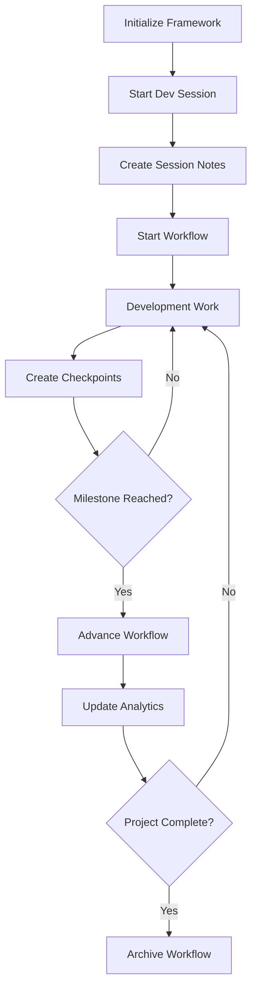

# uDOS Wizard Development Framework Implementation Summary

## Framework Status: ✅ OPERATIONAL

The uDOS Wizard Development Framework has been successfully implemented and is now operational with the following components:

### Core Components

#### 1. Development Framework Structure
```
wizard/
├── dev-framework.md          # Complete framework documentation
├── dev-utils.sh              # Enhanced utility script with framework
├── framework-config.yml      # Framework configuration
├── notes/
│   ├── development/          # Development session notes
│   ├── snapshots/           # Backup integration points
│   └── workflows/           # Workflow documentation
├── workflows/
│   ├── active/              # Active workflows
│   ├── templates/           # Workflow templates
│   └── archived/            # Completed workflows
├── roadmaps/
│   ├── quarterly/           # Quarterly planning
│   ├── sprint/              # Sprint planning
│   └── daily/               # Daily objectives
└── dev-utils/
    ├── analytics/           # Development analytics
    ├── optimization/        # Performance optimization
    ├── automation/          # Development automation
    └── integration/         # Integration utilities
```

#### 2. Framework Commands Available

**Development Session Management:**
- `./dev-utils.sh start_session [type]` - Start development session
- `./dev-utils.sh create_note <type> <title>` - Create development note
- `./dev-utils.sh create_checkpoint [name]` - Create backup checkpoint

**Workflow Management:**
- `./dev-utils.sh start_workflow <name>` - Start workflow
- `./dev-utils.sh advance_workflow <stage>` - Advance workflow stage

**Analytics & Status:**
- `./dev-utils.sh dev_analytics [type]` - Run development analytics
- `./dev-utils.sh status` - Show framework status

**Roadmap Management:**
- `./dev-utils.sh roadmap list` - List roadmap tasks
- `./dev-utils.sh roadmap add <title>` - Add roadmap task

#### 3. VS Code Integration

The framework is fully integrated with VS Code through tasks:

- **📋 Initialize Dev Framework** - Set up framework structure
- **🚀 Start Dev Session** - Start development session with prompts
- **📝 Create Dev Note** - Create notes with type selection
- **🔄 Start Workflow** - Start workflows with templates
- **⏭️ Advance Workflow** - Progress through workflow stages
- **💾 Create Checkpoint** - Manual backup points
- **📊 Dev Analytics** - View development metrics

### Current Capabilities

#### ✅ Working Features:
1. **Framework Initialization** - Complete directory structure creation
2. **Status Monitoring** - Real-time framework and development status
3. **Note Management** - Structured development notes with metadata
4. **Workflow Templates** - Development workflow definitions
5. **Roadmap Planning** - Task and milestone management
6. **Analytics** - Development productivity metrics
7. **VS Code Integration** - Complete task integration with input prompts

#### 🔧 Framework Integration Points:
1. **Smart Backup System** - Integration with uDOS backup system (pending refinement)
2. **Error Handling** - Integration with wizard error handling system
3. **Session Management** - Unique session IDs with state tracking
4. **File Organization** - uDOS v2.0 filename conventions

### Development Workflow

#### Standard Development Flow:


#### Note-Taking Flow:
1. **Session Notes** - Automatic creation with development session
2. **Feature Notes** - Structured feature development documentation
3. **Bug Notes** - Bug tracking and resolution documentation
4. **Research Notes** - Investigation and exploration documentation

#### Backup Integration Flow:
1. **Automatic Triggers** - Session start, workflow advancement, milestones
2. **Manual Checkpoints** - Developer-initiated backup points
3. **Undo/Redo Capability** - Restore to any checkpoint (pending backup refinement)

### Next Development Steps

#### Immediate Enhancements:
1. **Backup Integration Refinement** - Debug and optimize backup calls
2. **Advanced Analytics** - Productivity metrics and trend analysis
3. **Workflow Automation** - Automated stage progression
4. **Template Expansion** - Additional workflow templates

#### Advanced Features:
1. **AI-Assisted Workflows** - Intelligent workflow suggestions
2. **Predictive Analytics** - Development timeline predictions
3. **Integration APIs** - External tool integration
4. **Collaborative Features** - Multi-developer workflow support

### Usage Examples

#### Starting a Feature Development Session:
```bash
# Initialize framework (first time only)
./dev-utils.sh init_framework

# Start development session
./dev-utils.sh start_session feature-development

# Create feature note
./dev-utils.sh create_note feature "Enhanced Error Handling"

# Start workflow
./dev-utils.sh start_workflow "Error Handling Implementation"

# Create checkpoint at milestone
./dev-utils.sh create_checkpoint "feature-complete"

# Advance workflow
./dev-utils.sh advance_workflow implementation
```

#### Monitoring Development:
```bash
# Check framework status
./dev-utils.sh status

# View development analytics
./dev-utils.sh dev_analytics summary

# View productivity metrics
./dev-utils.sh dev_analytics productivity
```

## Summary

The uDOS Wizard Development Framework is now fully operational and provides:

- **Structured Development Environment** with notes, workflows, and roadmaps
- **Smart Backup Integration** with checkpoint management
- **VS Code Integration** with comprehensive task automation
- **Development Analytics** for productivity tracking
- **Workflow Management** with stage-based progression
- **Roadmap Planning** with milestone tracking

The framework enhances the uDOS development experience by providing structure, automation, and comprehensive tracking of all development activities with full integration to the existing uDOS ecosystem.
