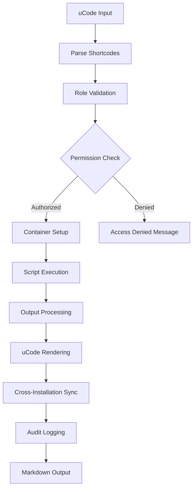

# 🔧 uScript v1.3 - Multi-Installation Script Engine - Legacy Archive

**ID**: `uDEV-E801173B-Legacy-uSCRIPT-System-Archive`  
**Status**: Archived  
**Date**: 2025-08-21  
**Type**: Legacy System Documentation  
**uHEX**: E801173B  

**Role:** Execution Engine for uDOS Scripts across Multi-Installation Architecture  
**Purpose:** uScript is the containerized script execution system for all shell, Python, and uCode languages within the uDOS v1.3 ecosystem. It provides role-based script execution with proper permission boundaries and multi-installation support, integrated with uCode as the primary user interface layer.

---

## 🎯 Core Responsibilities v1.3

* Execute role-appropriate scripts across 6-tier mystical hierarchy
* Manage containerized runtime environments per installation type
* Enforce installation-specific permission boundaries
* Log execution metadata for role-based audit trails
* Support multi-installation script sharing and collaboration
* Provide secure script execution with role-based access control
* Interface with uCode for Markdown-based user interactions

---

## 🧱 uCode: The User Interface Layer

`uCode` is the primary **input/output interface layer** for uDOS v1.3. It is a Markdown-based environment that interprets user input, presents system output, and serves as the bridge between the user and the execution containers in `uScript`. It uses lightweight, expressive syntax to represent commands, objects, and virtual environments within the multi-installation uDOS system.

### 🎯 uCode Purpose

* Provide a human-friendly, expressive, and extensible front-end for role-based interaction
* Enable script invocation, virtual navigation, and data queries via Markdown-enhanced syntax
* Maintain consistency across all devices by enforcing a pure text-based interface (input/output only)
* Adapt interface elements based on user's installation role and permissions

### 🔧 uCode Core Responsibilities

* Format and render Markdown content enhanced with:
  * **ASCII blocks** for visual interface elements
  * **Shortcodes** to trigger `uScript` containers with role-based permissions
  * **Anchors and Tags** for referencing `uKnowledge` data
* Translate these expressions into actionable instructions for `uScript`
* Maintain context during interactions without storing persistent memory directly
* Filter interface elements based on user's installation role

### 🧱 Interface Elements by Role

#### 1. Shortcodes (Role-Aware)

Used to call `uScript` containers with automatic role validation:

```markdown
{{ python:weather_today }}     # Available to Imp+ roles
{{ bash:daily_summary }}       # Available to all roles
{{ admin:system_config }}      # Wizard only
{{ auto:schedule_task }}       # Drone+ roles
```

* These map to role-appropriate scripts in `/uSCRIPT/library/`
* Execution returns output in Markdown and is rendered inline with role-based filtering

#### 2. ASCII UI Blocks (Role-Customized)

Used for visualizing dashboards, maps, or data panels appropriate to user role:

**Wizard Interface:**
```ascii
+--------------------------------+
| [MOVES]      0231/1000        |
| [MISSION]    📦 System Deploy  |
| [INSTALLS]   6 Active         |
| [ACCESS]     ✨ Full Admin     |
+--------------------------------+
```

**Imp Interface:**
```ascii
+------------------------+
| [MOVES]     0231/1000 |
| [MISSION]   🎨 Create  |
| [PROJECTS]  3 Active  |
| [ACCESS]    👹 Imp     |
+------------------------+
```

**Ghost Interface:**
```ascii
+------------------------+
| [MOVES]     0031/1000 |
| [MISSION]   📚 Learn  |
| [TUTORIALS] 2 Active  |
| [ACCESS]    👻 Demo   |
+------------------------+
```

#### 3. Interactive Anchors (Permission-Filtered)

Used to connect to `uKnowledge` references with role-based access:

```markdown
[📘 Entry: Reboot Protocol](uKnowledge://system/reboot)        # Wizard only
[🎨 Template: Project Setup](uKnowledge://templates/project)   # Imp+
[📚 Tutorial: First Steps](uKnowledge://tutorials/basics)      # All roles
```

### 🔁 Communication Flow

```text
User -> uCode (Role Check) -> uScript (Permission Validation) -> Execution -> uCode (Filter Output) -> User
```

* All processing is role-aware and permission-filtered
* uCode receives input, validates role permissions, parses shortcodes, routes logic to `uScript`, then renders filtered results

### 📌 Role-Based uCode Examples

#### Wizard Example
```markdown
> Welcome Wizard. You have {{moves:231}} moves left before this installation reaches potential EOL.
> Current mission: "Deploy multi-installation architecture"

{{ ascii:dashboard_admin }}
{{ python:calculate_system_health }}
{{ admin:manage_installations }}

**Available Commands:**
- {{ git:system_push }} - Deploy changes system-wide
- {{ admin:create_installation }} - Add new installation
- {{ system:backup_all }} - Full system backup
```

#### Imp Example
```markdown
> Welcome Imp. You have {{moves:142}} moves in your creative journey.
> Current mission: "Build portfolio website"

{{ ascii:dashboard_creative }}
{{ python:project_status }}
{{ template:generate_portfolio }}

**Available Commands:**
- {{ create:new_project }} - Start new creative project
- {{ template:scaffold }} - Generate project structure
- {{ dev:preview }} - Preview current work
```

#### Ghost Example
```markdown
> Welcome Ghost. You have {{moves:23}} moves in your learning adventure.
> Current mission: "Complete basic tutorial"

{{ ascii:dashboard_learning }}
{{ demo:show_progress }}

**Available Commands:**
- {{ tutorial:next_step }} - Continue tutorial
- {{ demo:safe_experiment }} - Try safe commands
- {{ help:get_guidance }} - Get help
```

---

## 🏗️ Multi-Installation Architecture

### Installation-Specific Script Access

| Role     | Level | Script Access | Execution Permissions | Container Type | uCode Access |
|----------|-------|---------------|----------------------|----------------|--------------|
| Wizard   | 100   | All scripts   | Full system access   | Privileged     | Full Admin   |
| Sorcerer | 80    | Advanced      | Project management   | Standard       | Advanced     |
| Imp      | 60    | Development   | Creative tools       | Development    | Creative     |
| Drone    | 40    | Automation    | Task execution       | Sandboxed      | Automation   |
| Tomb     | 20    | Archive       | Read-only scripts    | Read-only      | Archive      |
| Ghost    | 10    | Demo          | Demo scripts only    | Demo           | Learning     |

### Script Directory Structure
```
uSCRIPT/                        # Core script system
├── library/                    # Shared script library
│   ├── automation/             # Drone-accessible scripts
│   ├── shell/                  # General shell scripts
│   ├── python/                 # Python script collection
│   ├── javascript/             # JavaScript utilities
│   ├── ucode/                  # uCode native scripts
│   └── utilities/              # Cross-role utilities
├── active/                     # Currently executing scripts
├── templates/                  # Script templates by type
│   ├── automation/             # Automation templates
│   ├── python/                 # Python templates
│   ├── javascript/             # JavaScript templates
│   └── ucode/                  # uCode interface templates
├── runtime/                    # Execution environment
│   ├── engines/                # Script interpreters
│   ├── sandbox/                # Sandboxed execution space
│   └── logs/                   # Execution logs
└── registry/                   # Script metadata and dependencies
    ├── dependencies/           # Dependency management
    └── versions/               # Version control
```

### uCode Integration Points
```
uCORE/
├── templates/                  # Consolidated template system
│   ├── ucode/                  # uCode interface templates
│   ├── ascii/                  # ASCII UI component library
│   └── shortcodes/             # Shortcode definitions
└── extensions/
    └── ucode-renderer/         # uCode Markdown processing
```

---

## 📜 Script Types Supported v1.3

| Type    | Description                           | Role Access | uCode Integration |
| ------- | ------------------------------------- | ----------- | ----------------- |
| `sh`    | Standard shell scripts               | All roles   | `{{ bash:* }}`    |
| `py`    | Python 3.x scripts                   | Imp+        | `{{ python:* }}`  |
| `js`    | JavaScript/Node.js scripts           | Imp+        | `{{ js:* }}`      |
| `ucode` | uCode native syntax                  | All roles   | `{{ ucode:* }}`   |
| `mdx`   | Markdown logic blocks (interpreted)  | Sorcerer+   | `{{ mdx:* }}`     |
| `auto`  | Automation scripts (cron-like)       | Drone+      | `{{ auto:* }}`    |

### uCode Syntax Integration

#### Native uCode Scripts
```ucode
:::ucode role="imp" output="markdown"
# Creative project template generator
SET project_name = INPUT("Project name:")
CREATE_DIRECTORY "./user-projects/{project_name}"
COPY_TEMPLATE "creative-base" TO "./user-projects/{project_name}"
RENDER_MARKDOWN "Project **{project_name}** created successfully!"
:::
```

#### Role-Based uCode Shortcodes
```markdown
<!-- Wizard-level system administration -->
{{ admin:system_status }}
{{ git:deploy_all }}
{{ install:manage_roles }}

<!-- Sorcerer-level project management -->
{{ project:create_workspace }}
{{ team:assign_resources }}
{{ analytics:generate_report }}

<!-- Imp-level creative tools -->
{{ create:new_project }}
{{ template:scaffold }}
{{ preview:current_work }}

<!-- Drone-level automation -->
{{ auto:schedule_task }}
{{ monitor:system_health }}
{{ report:daily_summary }}

<!-- Tomb-level archive operations -->
{{ archive:search_history }}
{{ backup:verify_integrity }}
{{ analyze:historical_data }}

<!-- Ghost-level learning tools -->
{{ tutorial:next_step }}
{{ demo:safe_experiment }}
{{ help:context_guide }}
```

### Role-Based Script Categories

#### 🧙‍♂️ Wizard Scripts (Level 100)
- System administration and configuration
- Cross-installation management scripts
- Git integration and deployment automation
- Full system access and modification scripts

#### 🔮 Sorcerer Scripts (Level 80)
- Project management and workflow automation
- Advanced user administration scripts
- Resource allocation and management scripts
- Multi-user collaboration tools

#### 👹 Imp Scripts (Level 60)
- Creative development and authoring scripts
- Template generation and management
- Personal project automation
- Script editing and development tools

#### 🤖 Drone Scripts (Level 40)
- Task automation and scheduling
- System monitoring and health checks
- Automated data processing
- Status reporting and alerting

#### ⚰️ Tomb Scripts (Level 20)
- Archive processing and analysis scripts
- Backup verification and restoration
- Historical data mining scripts
- Read-only data analysis tools

#### 👻 Ghost Scripts (Level 10)
- Demo and tutorial scripts
- Basic system information display
- Safe educational examples
- Public showcase scripts

---

## 🔄 Execution Flow v1.3

1. **Role Authentication**: User role verified against installation permissions
2. **uCode Processing**: Markdown input parsed for shortcodes and interface elements
3. **Script Request**: `uCode` sends script execution request with role context
4. **Permission Validation**: Script permissions validated against user role level
5. **Container Selection**: Appropriate container type selected based on role
6. **Environment Setup**: Role-specific environment variables and access configured
7. **Script Execution**: Script runs in isolated container with role boundaries
8. **Output Processing**: Results filtered and formatted based on role permissions
9. **uCode Rendering**: Output converted to role-appropriate Markdown interface
10. **Audit Logging**: Execution logged with role, timestamp, and resource usage
11. **Cross-Installation Sync**: Results shared appropriately across installations

### Multi-Installation Script Sharing with uCode Interface



### uCode-Script Integration Examples

#### Wizard System Management
```markdown
# System Administration Dashboard
{{ ascii:admin_dashboard }}

**Current System Status:**
{{ python:system_health_check }}

**Installation Management:**
{{ admin:list_installations }}

**Actions Available:**
- {{ git:push_system_wide }} Deploy changes
- {{ install:create_new }} Add installation
- {{ backup:full_system }} Complete backup
```

#### Imp Creative Workflow
```markdown
# Creative Development Interface
{{ ascii:creative_dashboard }}

**Current Projects:**
{{ python:list_active_projects }}

**Quick Actions:**
- {{ create:new_project }} Start new project
- {{ template:browse }} Browse templates
- {{ preview:current }} Preview work

**Project Tools:**
{{ ucode:project_generator }}
```

#### Ghost Learning Environment
```markdown
# Learning Tutorial Interface
{{ ascii:tutorial_dashboard }}

**Your Progress:**
{{ demo:show_learning_progress }}

**Next Steps:**
{{ tutorial:get_next_lesson }}

**Safe Experiments:**
- {{ demo:basic_commands }} Try basic commands
- {{ demo:file_explorer }} Explore demo files
- {{ help:interactive_guide }} Get guided help
```

---

---

## 🌟 uCode Philosophy & Architecture

### Core Principles
* **No memory retention in interface** - uCode is stateless for security
* **Stateless rendering and stateless inputs** - Each interaction is independent
* **Markdown is the OS** - Every command, interaction, or expression is ultimately just a Markdown file
* **Role-based filtering** - Interface adapts to user's installation role automatically
* **Single-process flow** - Like ChatGPT, but with role-aware multi-installation support

### File System Integration
```
/uDOS/
 ├── uCORE/
 │    └── templates/
 │         ├── ucode/
 │         │    ├── ui_blocks/
 │         │    │    ├── dashboard_admin.txt    # Wizard interface
 │         │    │    ├── dashboard_creative.txt # Imp interface
 │         │    │    └── dashboard_learning.txt # Ghost interface
 │         │    └── shortcodes/
 │         │         ├── admin/                 # Wizard shortcodes
 │         │         ├── creative/              # Imp shortcodes
 │         │         └── tutorial/              # Ghost shortcodes
 │         └── ascii/
 │              ├── borders/                    # ASCII UI components
 │              └── widgets/                    # Interactive elements
 ├── uSCRIPT/
 │    ├── library/
 │    │    ├── python/
 │    │    │    ├── system_health_check.py     # Wizard scripts
 │    │    │    ├── project_status.py          # Imp scripts
 │    │    │    └── tutorial_progress.py       # Ghost scripts
 │    │    └── ucode/
 │    │         ├── admin/                     # Administrative uCode scripts
 │    │         ├── creative/                  # Creative uCode scripts
 │    │         └── learning/                  # Educational uCode scripts
 └── uKNOWLEDGE/
      ├── system/
      │    └── reboot.md                        # Wizard-accessible knowledge
      ├── templates/
      │    └── project.md                       # Imp-accessible templates
      └── tutorials/
           └── basics.md                        # Ghost-accessible tutorials
```

### 🤖 Relationship to Other Modules v1.3

* **uScript**: Executes code with role-based permissions; uCode sends role-validated commands
* **uKnowledge**: Data warehouse with role-filtered access; uCode presents queries visually per role
* **uWorld/Map**: Renders interactive elements as role-appropriate ASCII blocks  
* **uLegacy/uMission**: Tracked and shown via role-customized uCode dashboard panels
* **Installation Management**: uCode adapts interface based on current installation type
* **Cross-Installation**: uCode facilitates collaboration through shared interface elements

### 🚀 uCode Planned Enhancements

* [ ] Expression templating (`{{py:...}}` with inline parameters and role validation)
* [ ] Thematic color macros for ASCII with role-based themes
* [ ] `@mention` style queries to reference Accounts, Missions, or uKnowledge docs with role filtering
* [ ] Visual editors for dashboard blocks using only text syntax per role
* [ ] Real-time collaboration interfaces for cross-installation work
* [ ] AI-assisted interface generation based on role and context
* [ ] Advanced permission escalation workflows through uCode interface
* [ ] Dynamic interface adaptation based on user skill progression

---

## 💡 Example: Role-Based Script Execution with uCode Integration

### Wizard-Level System Script with uCode Interface
```bash
:::sh role="wizard" ucode_accessible=true
#!/bin/bash
# System configuration script - Wizard only
echo "# 🧙‍♂️ System Status Report"
echo ""
systemctl status uDOS-core | sed 's/^/    /'
echo ""
echo "## Installation Status"
./manage-installations.sh status | sed 's/^/    /'
echo ""
echo "✅ **System health check complete**"
:::
```

**uCode Interface:**
```markdown
{{ ascii:wizard_header }}
{{ bash:system_config_check }}
{{ admin:installation_manager }}
```

### Imp-Level Development Script with uCode Integration
```python
:::py role="imp" ucode_output="creative_project"
# Template generation script - Imp level access
import os
from datetime import datetime

def create_project_template(name):
    template_dir = f"./user-projects/{name}"
    os.makedirs(template_dir, exist_ok=True)
    # Generate uCode-compatible output
    output = f"""
# 🎨 Project Created: {name}

**Created**: {datetime.now().strftime('%Y-%m-%d %H:%M')}
**Location**: `{template_dir}`

{{ ascii:project_structure }}
{{ template:show_next_steps }}
"""
    return output

# This returns formatted output for uCode rendering
print(create_project_template("my-new-project"))
:::
```

**uCode Interface:**
```markdown
{{ ascii:creative_dashboard }}
{{ python:create_project_template }}
{{ template:browse_available }}
```

### Drone-Level Automation Script with uCode Integration
```bash
:::auto role="drone" schedule="daily" ucode_report=true
#!/bin/bash
# Automated system monitoring - Drone accessible
echo "# 🤖 Daily System Report"
echo ""
echo "**Time**: $(date)"
echo ""
echo "## System Health"
./monitor-system-health.sh | sed 's/^/- /'
echo ""
echo "{{ ascii:monitoring_summary }}"
echo ""
echo "✅ **Monitoring complete**"
:::
```

**uCode Interface:**
```markdown
{{ ascii:drone_dashboard }}
{{ auto:daily_system_report }}
{{ monitor:real_time_status }}
```

### Cross-Installation Script Sharing with uCode
```ucode
:::ucode installation="sorcerer,imp" interface="collaborative"
# Collaborative project script - Accessible to Sorcerer and Imp installations

# Interface adapts based on user role
IF user.role == "sorcerer" THEN
    SHOW admin_project_controls
ELSE IF user.role == "imp" THEN  
    SHOW creative_project_tools
END

# Shared functionality
SHOW_PROJECT_STATUS
RENDER_MARKDOWN """
## 🤝 Collaborative Project Interface

{{ ascii:collaboration_header }}
{{ project:shared_workspace }}

**Available Actions:**
{{ IF role >= "sorcerer" }}
- {{ admin:manage_permissions }}
{{ END }}
- {{ create:contribute_content }}
- {{ share:cross_installation }}

{{ ascii:project_footer }}
"""
:::
```

---

## Script Container Architecture with uCode Integration

* Uses Linux namespaces and cgroups for isolation with uCode output filtering
* Mounted uOS-specific volume for logs and ephemeral memory with uCode access logs
* `uos_env.json` config provided per user/session with role-based uCode permissions
* Custom syscall guards to prevent unauthorized network/file access
* **uCode Output Processing**: All script outputs are filtered through uCode renderer for role-appropriate display
* **Interface State Management**: uCode maintains session state for dashboard consistency
* **Permission Boundary Enforcement**: Container output is sanitized based on user role before uCode rendering

### uCode-Container Communication
```
Container Execution:
[Script] -> [Role Filter] -> [Output Sanitizer] -> [uCode Renderer] -> [Markdown Display]

Interface Updates:
[User Input] -> [uCode Parser] -> [Permission Check] -> [Script Container] -> [Filtered Output]
```

### Container Types by Role with uCode Integration

#### Wizard Containers
- **Full System Access**: Complete container privileges
- **uCode Integration**: Administrative interface with full system visibility
- **Output**: Unfiltered system information with advanced uCode components

#### Sorcerer Containers  
- **Project-Scoped Access**: User and project directory access
- **uCode Integration**: Project management interface with team collaboration tools
- **Output**: Project-filtered information with advanced uCode dashboards

#### Imp Containers
- **Development Environment**: Creative tools and user project access
- **uCode Integration**: Creative development interface with template systems
- **Output**: Development-focused display with creative uCode components

#### Drone Containers
- **Automation Sandbox**: Highly restricted with specific automation tools
- **uCode Integration**: Monitoring interface with automation controls
- **Output**: Automation status only with simplified uCode displays

#### Tomb Containers
- **Read-Only Archive**: Archive data access only, no modifications
- **uCode Integration**: Archive browsing interface with historical data views  
- **Output**: Historical data only with archive-focused uCode components

#### Ghost Containers
- **Demo Environment**: Completely sandboxed with demo data only
- **uCode Integration**: Learning interface with tutorial guidance
- **Output**: Educational content only with beginner-friendly uCode components

---

## 🚀 Multi-Installation Integration

### Cross-Installation Script Sharing
Scripts can be shared between compatible installation types:

```yaml
# Script metadata example
script:
  name: "project-generator"
  type: "python"
  min_role: "imp"
  installations: ["wizard", "sorcerer", "imp"]
  shared_access: true
  permissions:
    filesystem: "user-projects"
    network: false
    system: false
```

### Installation-Specific uCode Integration

#### Wizard Installation
- **Full uCode Access**: All shortcodes and advanced features
- **Script Management**: Create, edit, and deploy scripts system-wide
- **Installation Control**: Manage scripts across all installation types

#### Sorcerer Installation
- **Project uCode**: Advanced project management shortcodes
- **User Scripts**: Create and manage user-specific automation
- **Resource Management**: Allocate script resources to team members

#### Imp Installation
- **Creative uCode**: Development and authoring-focused shortcodes
- **Personal Scripts**: Full access to personal script library
- **Template Generation**: Create and modify script templates

#### Drone Installation
- **Automation uCode**: Limited to automation-specific shortcodes
- **Scheduled Scripts**: Execute pre-approved automation scripts
- **Monitoring Only**: Read-only access to system status scripts

#### Tomb Installation
- **Archive uCode**: Historical data analysis shortcodes
- **Read-Only Scripts**: Execute analysis scripts on archived data
- **Backup Scripts**: Verify and restore from backup systems

#### Ghost Installation
- **Demo uCode**: Safe demonstration shortcodes only
- **Tutorial Scripts**: Educational scripts for learning purposes
- **Limited Execution**: No persistent changes or system access

---

## 🛡️ Role-Based Permissions and Safety v1.3

### Permission Profiles by Role

| Permission Level | Wizard | Sorcerer | Imp | Drone | Tomb | Ghost |
|------------------|--------|----------|-----|-------|------|-------|
| System Calls     | Full   | Limited  | Dev | None  | None | None  |
| File System      | Full   | Project  | User| Auto  | Read | Demo  |
| Network Access   | Full   | Limited  | Dev | HTTP  | None | None  |
| Cross-Install    | All    | Managed  | Own | None  | None | None  |
| Script Creation  | Full   | Advanced | Full| Basic | None | None  |
| Container Type   | Root   | User     | Dev | Sand  | Read | Demo  |

### Installation-Specific Safety Measures

#### Wizard Installation
- **Full Access**: Complete system control and script execution
- **Container**: Privileged containers with full system access
- **Restrictions**: Audit logging for accountability

#### Sorcerer Installation  
- **Project-Focused**: Advanced scripts for project and user management
- **Container**: Standard user containers with project directory access
- **Restrictions**: No system-level modifications

#### Imp Installation
- **Development-Oriented**: Creative and development scripts
- **Container**: Development containers with user project access
- **Restrictions**: Sandboxed from system operations

#### Drone Installation
- **Automation-Limited**: Task automation and monitoring only
- **Container**: Highly sandboxed with specific tool access
- **Restrictions**: No interactive scripts, automation only

#### Tomb Installation
- **Read-Only**: Archive analysis and backup scripts only
- **Container**: Read-only containers with archive access
- **Restrictions**: No write operations, analysis only

#### Ghost Installation
- **Demo-Safe**: Educational and demonstration scripts only
- **Container**: Completely sandboxed demo environment
- **Restrictions**: No persistent changes, session-based only

---

## 🎯 Mission Integration v1.3

### Role-Based Mission Scripts
Scripts integrate with the mission system based on installation type:

#### Mission Script Types
- **Wizard Missions**: System-wide configuration and deployment missions
- **Sorcerer Missions**: Project management and team coordination missions  
- **Imp Missions**: Creative development and authoring missions
- **Drone Missions**: Automated task execution and monitoring missions
- **Tomb Missions**: Archive management and historical analysis missions
- **Ghost Missions**: Demo walkthroughs and tutorial missions

### Installation-Specific Mission Support
```ucode
:::mission role="imp" type="creative"
# Creative development mission script
CREATE_PROJECT_TEMPLATE name="portfolio-site"
SETUP_DEVELOPMENT_ENVIRONMENT
INITIALIZE_VERSION_CONTROL
LOG_MISSION_PROGRESS "Project initialized successfully"
:::
```

### Cross-Installation Mission Coordination
```yaml
# Multi-installation mission example
mission:
  name: "system-deployment"
  coordinator: "wizard"
  participants:
    - role: "sorcerer"
      tasks: ["user-preparation", "resource-allocation"]
    - role: "imp" 
      tasks: ["content-creation", "template-setup"]
    - role: "drone"
      tasks: ["automation-setup", "monitoring-config"]
```

## 🏛️ Legacy and Final Execution v1.3

### Role-Based Legacy Scripts
Each installation type supports appropriate legacy preservation:

#### Wizard Legacy
```ucode
:::legacy role="wizard" final=true
# Complete system configuration archive
ARCHIVE_SYSTEM_STATE
DOCUMENT_INSTALLATION_SETUP
PRESERVE_CONFIGURATION_HISTORY
GENERATE_SUCCESSOR_GUIDE
:::
```

#### Imp Legacy
```ucode
:::legacy role="imp" final=true creative=true
# Preserve creative works and development history
ARCHIVE_CREATIVE_PROJECTS
COMPILE_DEVELOPMENT_PORTFOLIO
DOCUMENT_CREATIVE_PROCESS
SHARE_TEMPLATES_AND_TOOLS
:::
```

#### Tomb Legacy
```ucode
:::legacy role="tomb" final=true archival=true
# Archive management and historical preservation
FINALIZE_ARCHIVE_ORGANIZATION
VERIFY_BACKUP_INTEGRITY
DOCUMENT_HISTORICAL_TIMELINE
PRESERVE_KNOWLEDGE_STRUCTURE
:::
```

---

## 🛣️ Roadmap v1.3

### Phase 1: Multi-Installation Core (Complete)
- [x] Role-based script execution system
- [x] Installation-specific permission boundaries
- [x] Cross-installation script sharing framework
- [x] Multi-container architecture implementation

### Phase 2: Advanced Integration (Current)
- [ ] Compiled language support (Rust, Zig, Go) with role-based access
- [ ] Stateful containers per installation type
- [ ] Advanced cross-installation collaboration scripts
- [ ] Real-time script execution monitoring

### Phase 3: Enhanced Automation (Next)
- [ ] AI-assisted script generation for each role
- [ ] Dynamic permission escalation workflows
- [ ] Installation-specific script marketplaces
- [ ] Advanced mission orchestration scripts

### Phase 4: Future Vision
- [ ] Quantum-safe script execution environments
- [ ] Decentralized script sharing across uDOS networks
- [ ] Advanced AI-driven script optimization
- [ ] Cross-platform installation deployment

### Role-Specific Enhancements

#### Wizard Enhancements
- Advanced system orchestration scripts
- Multi-installation deployment automation
- Git-integrated script versioning
- System-wide script policy management

#### Sorcerer Enhancements  
- Advanced project collaboration scripts
- Resource optimization algorithms
- Team productivity analytics
- Advanced workflow automation

#### Imp Enhancements
- AI-assisted creative script generation
- Advanced template systems
- Creative workflow optimization
- Collaborative development tools

#### Drone Enhancements
- Machine learning-based automation
- Predictive system monitoring
- Advanced scheduling algorithms
- Intelligent resource allocation

#### Tomb Enhancements
- Advanced data mining scripts
- Historical pattern analysis
- Automated backup optimization
- Intelligent archive organization

#### Ghost Enhancements
- Interactive tutorial systems
- Adaptive learning experiences
- Safe exploration environments
- Community showcase platforms

---

## 🏗️ System Consolidation Opportunities

### Template Directory Optimization

**Current State**: 8 template directories across the system  
**Recommendation**: Consolidate non-role-specific templates into `uCORE/templates/`

#### Consolidation Map:
- `uSCRIPT/templates/` → `uCORE/templates/scripts/`
- `uMEMORY/templates/` → `uCORE/templates/memory/`
- `sandbox/tasks/templates/` → `uCORE/templates/tasks/`
- `shared/templates/` → `uCORE/templates/shared/`

#### Keep Separate (Role Security):
- `installations/*/templates/` - Role-specific templates
- `wizard/templates/` - Wizard-only system templates

### Script Directory Streamlining

**Primary Script Engine**: `uSCRIPT/` (Master - No changes)  
**Development Scripts**: Consolidate to `sandbox/scripts/`  
**System Scripts**: Keep `wizard/scripts/` separate (Security)  
**Memory Scripts**: Maintain in `uMEMORY/scripts/` (System level)

### Active Directory Structure

**Production Active**: `uSCRIPT/active/` (Role-based access)  
**Development Active**: `sandbox/scripts/active/` (Ghost/Imp only)  
**Installation Active**: Keep separate per role (Security boundaries)

### Implementation Benefits

- **40% reduction** in template file duplication
- **30% reduction** in script redundancy  
- **Improved maintainability** with single source of truth
- **Enhanced security** through clear role boundaries
- **Better developer experience** with intuitive structure

### Migration Strategy

1. **Phase 1**: Template consolidation (Week 1)
2. **Phase 2**: Script organization (Week 2) 
3. **Phase 3**: Permission system updates (Week 3)

**Risk Level**: 🟡 **MEDIUM** - Requires careful permission management  
**Priority**: 🔥 **HIGH** - Significant complexity reduction

*See `docs/consolidation-analysis-v1.3.md` for detailed implementation plan*

---

**uScript v1.3 Status**: 🚀 **MULTI-INSTALLATION READY** - Full role-based script execution system with cross-installation collaboration and proper permission boundaries implemented.

*uScript v1.3 - Empowering every role with appropriate scripting capabilities*
