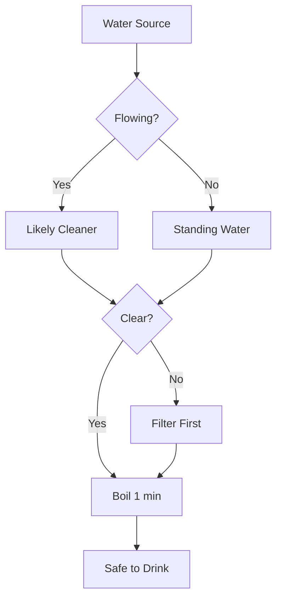
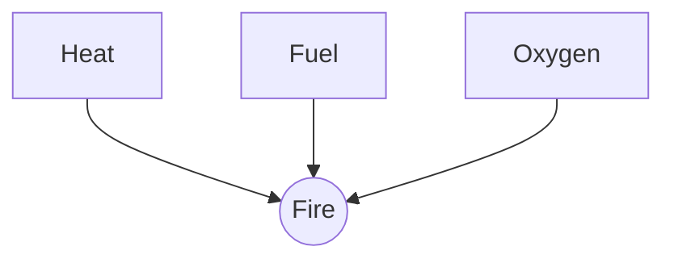
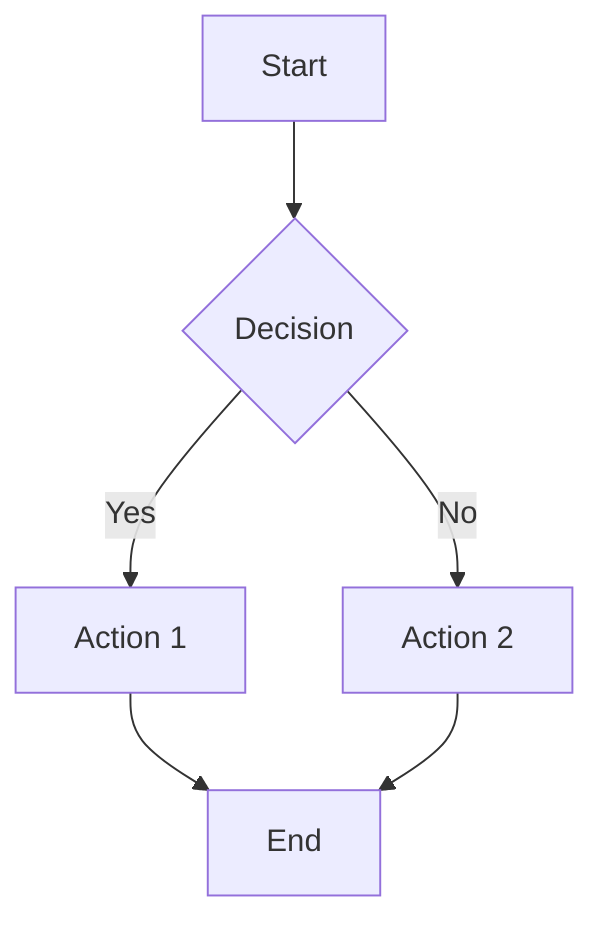
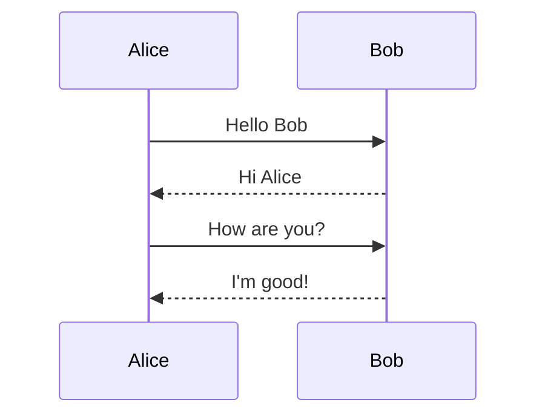
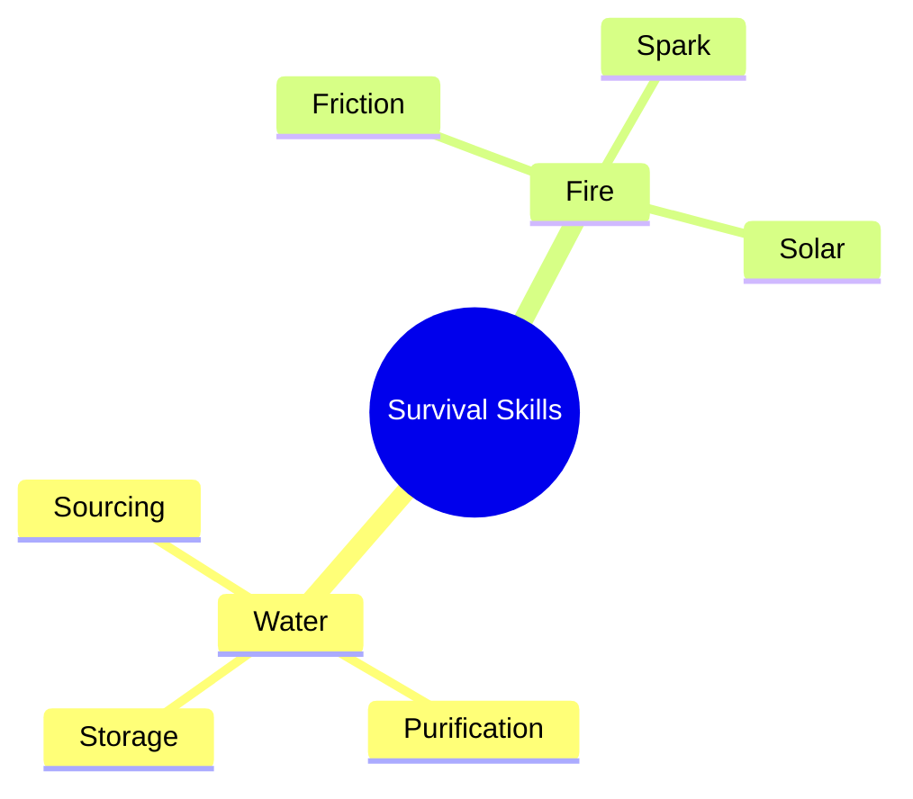
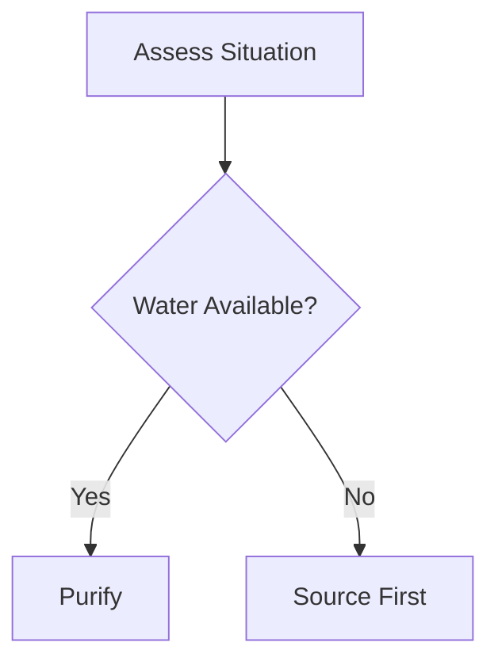

# Diagram Format Compatibility - GitHub vs Typora

**Date:** December 2, 2025
**Context:** v1.1.15 Graphics Infrastructure - Mermaid Integration Research
**Purpose:** Clarify format compatibility for implementation decisions

---

## 📊 Overview

Both GitHub and Typora enable **text-based diagrams in Markdown** via fenced code blocks, eliminating the need for external image files. This approach offers significant advantages for version control, collaboration, and content management.

### Key Benefits (Both Platforms)

✅ **Git-friendly**: Text-based syntax can be versioned, diffed, and merged
✅ **No external files**: Diagrams embedded directly in markdown
✅ **Easy editing**: Plain text syntax, no specialized tools required
✅ **Copy/paste friendly**: Share diagram code as easily as text
✅ **Portability**: Diagrams travel with the markdown document

---

## 🔄 Format Compatibility Matrix

### GitHub Supported Formats

GitHub renders diagrams **server-side** in:
- Issues
- Pull Requests
- Discussions
- Wikis
- Markdown files (`.md` in repositories)

| Format | Syntax | Use Case | Example |
|--------|--------|----------|---------|
| **Mermaid** | ````mermaid` | Flowcharts, sequence, Gantt, class, state, pie, gitgraph, mindmap, timeline, quadrant, Sankey, XY charts | General-purpose diagrams |
| **GeoJSON** | ````geojson` | Interactive maps | Territory mapping, resource locations |
| **TopoJSON** | ````topojson` | Topology-preserving maps | Efficient geographic data |
| **ASCII STL** | ````stl` | 3D model wireframes | Shelter designs, tool models |

**Total:** 4 diagram syntaxes (Mermaid + 3 specialized formats)

### Typora Supported Formats

Typora renders diagrams **client-side** (in the editor) using multiple JavaScript libraries:

| Format | Library | Syntax | Use Case |
|--------|---------|--------|----------|
| **Mermaid** | mermaid.js | ````mermaid` | Sequence, flowchart, Gantt, class, state, pie, gitgraph, mindmap, timeline, quadrant, Sankey, ZenUML, XY charts |
| **Flowcharts** | flowchart.js | ````flow` | Process flows (alternative to Mermaid flowcharts) |
| **Sequence** | js-sequence | ````sequence` | Actor interactions (alternative to Mermaid sequence) |

**Total:** 3 rendering engines, 2+ diagram syntaxes (Mermaid is dominant)

**Key Observation:** Typora's "broader set" primarily refers to **Mermaid's extensive diagram type support** (12+ types within Mermaid), not fundamentally different syntaxes. The flowchart.js and js-sequence syntaxes are legacy alternatives to Mermaid.

---

## 🎯 Implications for uDOS v1.1.15

### Design Decisions

**1. Primary Format: Mermaid** ✅
- **Why:** Supported by both GitHub and Typora
- **Coverage:** 12+ diagram types (sequence, flowchart, Gantt, class, state, pie, gitgraph, mindmap, timeline, quadrant, Sankey, XY)
- **Portability:** Diagrams render in GitHub wikis, PRs, issues
- **Recommendation:** **Prioritize Mermaid as the unified diagram format**

**2. GitHub Extended Formats** ✅ (Phase 2)
- **GeoJSON/TopoJSON:** Essential for navigation guides (water sources, terrain mapping)
- **ASCII STL:** Valuable for shelter/tool 3D models
- **Recommendation:** **Implement in Phase 2 for specialized use cases**

**3. Typora Legacy Formats** ⚠️ (Deprioritize)
- **flowchart.js** (````flow`): Redundant with Mermaid flowcharts
- **js-sequence** (````sequence`): Redundant with Mermaid sequence diagrams
- **Recommendation:** **Skip legacy formats, use Mermaid equivalents**

### Compatibility Strategy

**Goal:** Ensure uDOS diagrams render correctly in:
1. **uDOS knowledge bank** (local rendering)
2. **GitHub wiki** (server-side rendering)
3. **Typora editor** (if users edit guides locally)

**Approach:**
```
┌─────────────────────────────────────────────────────────────┐
│ uDOS Knowledge Guides (.md files)                           │
│                                                              │
│   ```mermaid                 # ✅ Renders in all 3 contexts │
│   graph TD;                  # (uDOS, GitHub, Typora)       │
│     A-->B;                                                   │
│   ```                                                        │
│                                                              │
│   ```geojson                 # ✅ Renders in GitHub + uDOS  │
│   {"type": "Feature", ...}   # ⚠️  Plain text in Typora     │
│   ```                                                        │
│                                                              │
│   ```flow                    # ⚠️  Only renders in Typora   │
│   st=>start: Start           # ❌ Plain text in GitHub/uDOS │
│   ```                        # (AVOID - use Mermaid instead)│
└─────────────────────────────────────────────────────────────┘
```

**Decision Matrix:**

| Diagram Need | Format Choice | Rationale |
|--------------|---------------|-----------|
| Flowchart | ````mermaid` (type: flowchart) | Universal compatibility |
| Sequence diagram | ````mermaid` (type: sequence) | Universal compatibility |
| Decision tree | ````mermaid` (type: flowchart) | Universal compatibility |
| Timeline | ````mermaid` (type: timeline) | Universal compatibility |
| Map (navigation) | ````geojson` | GitHub + uDOS support |
| 3D model (shelter) | ````stl` | GitHub + uDOS support |
| ~~Legacy flowchart~~ | ~~````flow`~~ | **Deprecated** (use Mermaid) |
| ~~Legacy sequence~~ | ~~````sequence`~~ | **Deprecated** (use Mermaid) |

---

## 📋 Recommended Implementation Phases

### Phase 1: Mermaid Integration (Priority 1) ✅

**Focus:** Universal compatibility via Mermaid

**Diagram Types to Implement:**
1. **Flowchart** - Decision trees (water purification, fire selection)
2. **Sequence** - Process flows (shelter construction steps)
3. **State** - State machines (mission workflows)
4. **Pie** - Proportional data (resource allocation)
5. **Gitgraph** - Version/timeline visualization
6. **Mindmap** - Concept hierarchies (survival skills taxonomy)

**Rendering Approach:**
- **Server-side pre-rendering** (mermaid-cli + puppeteer)
  - ✅ Offline-compatible
  - ✅ Consistent with uDOS philosophy
  - ✅ Output: SVG/PNG for embedding
- **Client-side fallback** (web dashboard)
  - For interactive preview/editing

**Test Cases:**
```markdown
# Water Purification Decision Tree


# Fire Triangle Concept


# Shelter Construction Timeline
```mermaid
timeline
    title A-Frame Shelter Build
    Section 1 : Site Selection : Clear Ground : Level Area
    Section 2 : Frame Assembly : Ridge Pole : Support Beams
    Section 3 : Cover : Leaves/Bark : Insulation Layer
    Section 4 : Weatherproofing : Test Drainage : Seal Gaps
```
```

### Phase 2: GitHub Extended Formats (Priority 2) ✅

**GeoJSON Maps:**
```markdown
# Water Sources Map
```geojson
{
  "type": "FeatureCollection",
  "features": [
    {
      "type": "Feature",
      "properties": {
        "name": "Creek",
        "water_type": "flowing",
        "reliability": "seasonal"
      },
      "geometry": {
        "type": "LineString",
        "coordinates": [
          [151.2093, -33.8688],
          [151.2105, -33.8695]
        ]
      }
    },
    {
      "type": "Feature",
      "properties": {
        "name": "Spring",
        "water_type": "fresh",
        "reliability": "year-round"
      },
      "geometry": {
        "type": "Point",
        "coordinates": [151.2100, -33.8690]
      }
    }
  ]
}
```
```

**ASCII STL 3D Models:**
```markdown
# A-Frame Shelter Structure
```stl
solid a_frame_shelter
  facet normal 0.0 1.0 0.0
    outer loop
      vertex 0.0 0.0 0.0
      vertex 3.0 2.0 0.0
      vertex 0.0 0.0 4.0
    endloop
  endfacet
  facet normal 0.0 1.0 0.0
    outer loop
      vertex 3.0 2.0 0.0
      vertex 3.0 2.0 4.0
      vertex 0.0 0.0 4.0
    endloop
  endfacet
endsolid
```
```

### Phase 3: Legacy Format Migration (Optional) ⚠️

**Only if existing content uses legacy formats:**

Convert existing ````flow` → ````mermaid` (flowchart)
Convert existing ````sequence` → ````mermaid` (sequence)

**Migration Script:**
```python
# dev/tools/migrate_legacy_diagrams.py
def convert_flow_to_mermaid(flow_code: str) -> str:
    """Convert flowchart.js syntax to Mermaid flowchart."""
    # Parse flow syntax: st=>start: Start
    # Convert to Mermaid: A[Start]
    pass

def convert_sequence_to_mermaid(seq_code: str) -> str:
    """Convert js-sequence syntax to Mermaid sequence."""
    # Parse sequence syntax: Alice->Bob: Hello
    # Convert to Mermaid: Alice->>Bob: Hello
    pass
```

---

## 🔍 Format Comparison Examples

### Flowchart: Mermaid vs flowchart.js

**Mermaid (Recommended):**


**flowchart.js (Legacy, Typora-only):**
```flow
st=>start: Start
op1=>operation: Action 1
op2=>operation: Action 2
cond=>condition: Decision
e=>end: End

st->cond
cond(yes)->op1->e
cond(no)->op2->e
```

**Winner:** Mermaid (universal compatibility, modern syntax)

### Sequence Diagram: Mermaid vs js-sequence

**Mermaid (Recommended):**


**js-sequence (Legacy, Typora-only):**
```sequence
Alice->Bob: Hello Bob
Note right of Bob: Bob thinks
Bob-->Alice: Hi Alice
Alice->Bob: How are you?
Bob-->Alice: I'm good!
```

**Winner:** Mermaid (GitHub compatible, more features)

---

## 📊 Feature Coverage Analysis

### Diagram Types Needed for uDOS Knowledge Bank

| Use Case | Diagram Type | Recommended Format |
|----------|--------------|-------------------|
| **Water purification process** | Flowchart | ````mermaid` (flowchart) |
| **Fire selection decision tree** | Flowchart | ````mermaid` (flowchart) |
| **Shelter construction steps** | Timeline | ````mermaid` (timeline) |
| **First aid protocol** | Sequence | ````mermaid` (sequence) |
| **State machine (missions)** | State diagram | ````mermaid` (state) |
| **Resource allocation** | Pie chart | ````mermaid` (pie) |
| **Skill hierarchy** | Mindmap | ````mermaid` (mindmap) |
| **Territory mapping** | Map | ````geojson` |
| **Water source locations** | Map | ````geojson` |
| **Navigation routes** | Map | ````topojson` |
| **Shelter 3D model** | 3D wireframe | ````stl` |
| **Tool design** | 3D wireframe | ````stl` |
| **Trap mechanism** | 3D wireframe | ````stl` |

**Coverage:**
- **Mermaid:** 7/13 use cases (54%) ✅ **Core format**
- **GeoJSON/TopoJSON:** 3/13 use cases (23%) ✅ **Specialized maps**
- **ASCII STL:** 3/13 use cases (23%) ✅ **Specialized 3D**

**Conclusion:** Mermaid + GitHub extended formats provide 100% coverage for uDOS needs.

---

## 🎯 Final Recommendations

### For uDOS v1.1.15 Implementation

**1. Prioritize Mermaid (Phase 1)** ✅
- Universal compatibility (GitHub + Typora + uDOS)
- Covers 54% of diagram needs
- Single syntax to learn/maintain
- Future-proof (active development)

**2. Add GitHub Extended Formats (Phase 2)** ✅
- GeoJSON/TopoJSON for navigation guides
- ASCII STL for 3D shelter/tool models
- Fills remaining 46% of diagram needs

**3. Avoid Legacy Typora Formats** ❌
- flowchart.js (````flow`) → Use Mermaid flowchart instead
- js-sequence (````sequence`) → Use Mermaid sequence instead
- Reason: Limited compatibility, redundant functionality

**4. Rendering Strategy** ✅
- **Primary:** Server-side pre-rendering (mermaid-cli)
  - Offline-compatible
  - Generates static SVG/PNG
  - No JavaScript dependencies for viewing
- **Secondary:** Client-side rendering (web dashboard)
  - Interactive preview/editing
  - Live updates during diagram creation

**5. Documentation Standards** ✅
- **All knowledge guides:** Use Mermaid syntax
- **Navigation guides:** Add GeoJSON maps where applicable
- **Shelter/tool guides:** Add STL 3D models where helpful
- **Avoid:** Legacy Typora-specific syntax (flow, sequence)

### Content Creator Guidelines

**When writing knowledge guides:**

✅ **DO:**
- Use ````mermaid` for flowcharts, sequences, timelines, state machines
- Use ````geojson` for maps (water sources, territories, routes)
- Use ````stl` for 3D models (shelters, tools, traps)
- Test rendering in GitHub wiki preview

❌ **DON'T:**
- Use ````flow` (legacy flowchart syntax)
- Use ````sequence` (legacy sequence syntax)
- Assume Typora-specific features will render elsewhere

**Example Template:**
```markdown
# Guide Title

## Conceptual Overview


## Decision Process


## Geographic Context
```geojson
{
  "type": "FeatureCollection",
  "features": [...]
}
```
```

---

## 📚 Reference Links

**Mermaid Documentation:**
- Official docs: https://mermaid.js.org/
- Syntax reference: https://mermaid.js.org/intro/
- Live editor: https://mermaid.live/

**GitHub Diagram Support:**
- Creating diagrams: https://docs.github.com/en/get-started/writing-on-github/working-with-advanced-formatting/creating-diagrams
- GeoJSON spec: https://geojson.org/
- TopoJSON spec: https://github.com/topojson/topojson
- STL format: https://en.wikipedia.org/wiki/STL_(file_format)

**Typora Documentation:**
- Diagram support: https://support.typora.io/Draw-Diagrams-With-Markdown/
- Mermaid options: https://support.typora.io/Draw-Diagrams-With-Markdown/#mermaid

**uDOS Planning:**
- v1.1.15 planning: `dev/sessions/2025-12-02_v1.1.15_graphics_planning.md`
- Roadmap: `dev/roadmap/ROADMAP.md`

---

**Summary:** Mermaid provides universal compatibility across GitHub, Typora, and uDOS with comprehensive diagram type coverage. Legacy Typora formats (flow, sequence) offer no additional value and should be avoided to maximize portability.
