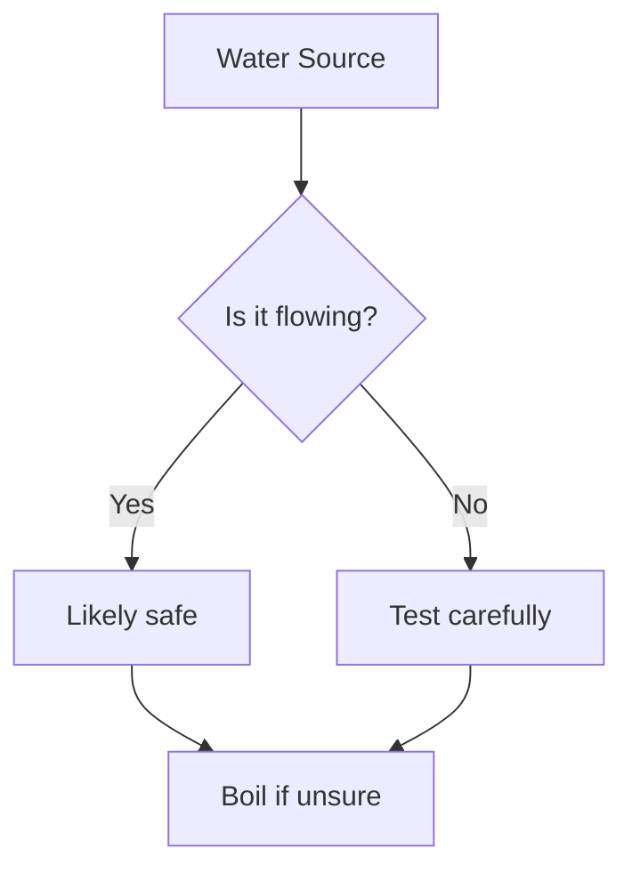
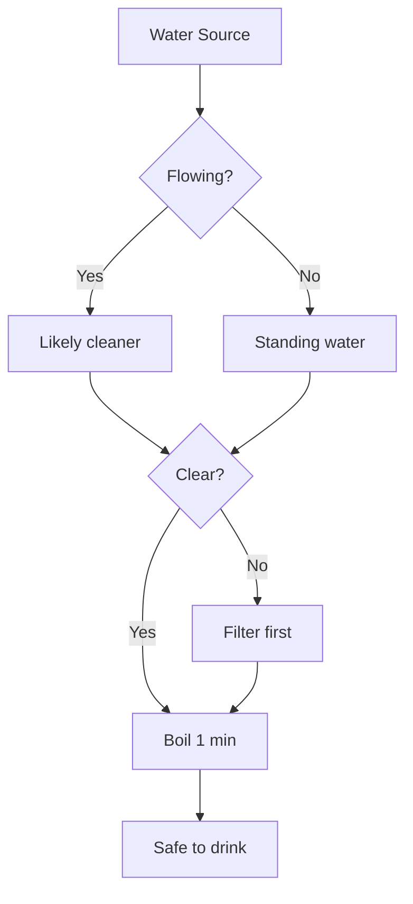
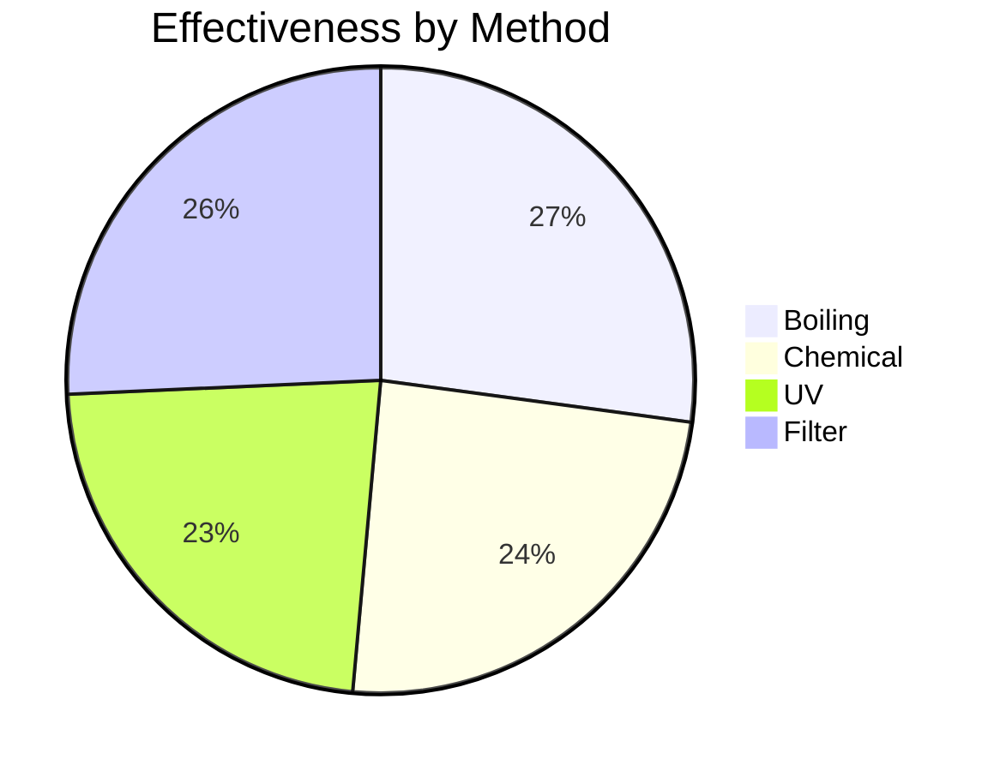

# v1.1.15 Graphics Infrastructure Planning

**Session Date:** December 2, 2025
**Version:** v1.1.15 (Planning Phase)
**Status:** Research and Architecture Design
**Priority:** High - Blocks content quality improvements

---

## 🎯 Strategic Context

### Why Graphics Infrastructure Now?

Before expanding knowledge bank content (currently 136+ guides across 6 categories), we need to improve visual tools to ensure consistent, high-quality diagrams. The current graphics infrastructure has significant gaps:

**Current State (v1.1.13):**
- ✅ ASCII art library browser (`diagram_handler.py` - 13 types)
- ✅ Nano Banana SVG pipeline (`generate_handler.py` - AI → PNG → SVG)
- ❌ No Mermaid diagram support (flowcharts, sequence, state machines)
- ❌ No GitHub diagram formats (GeoJSON maps, ASCII STL 3D)
- ❌ ASCII graphics quality needs improvement ("chunky")
- ⚠️ Nano Banana needs finetuning for technical diagrams

**Strategic Approach:**
1. Build better graphics tools (v1.1.15)
2. Create diagram specifications for knowledge bank
3. Systematically upgrade existing 136+ guides
4. Use new tools for all future content

This ensures visual consistency and quality across all survival knowledge.

---

## 📊 Current Graphics Infrastructure Analysis

### Existing Systems

#### 1. `diagram_handler.py` (v1.0.21, 880 lines)

**Purpose:** ASCII art library browser and renderer
**Location:** `core/commands/diagram_handler.py`
**Storage:** `core/data/diagrams/`

**Commands:**
```bash
DIAGRAM LIST                    # List all diagrams
DIAGRAM SEARCH <query>          # Search diagrams
DIAGRAM SHOW <name>             # Display diagram
DIAGRAM RENDER <name>           # Render diagram
DIAGRAM COPY <name>             # Copy to clipboard
DIAGRAM EXPORT <name> <format>  # Export diagram
DIAGRAM TYPES                   # List diagram types
DIAGRAM GENERATE <spec>         # Generate from spec
```

**Diagram Types (13):**
- knot, shelter, chart, map, flow, circuit
- anatomy, plant, tool, symbol, timeline, table, ascii

**Key Methods:**
```python
def _list(self, args: List[str]) -> str:
    """List available diagrams."""
    
def _search(self, args: List[str]) -> str:
    """Search diagrams by keyword."""
    
def _show(self, args: List[str]) -> str:
    """Display a specific diagram."""
    
def _generate(self, args: List[str]) -> str:
    """Generate diagram from specification."""
```

**Strengths:**
- Pre-built library of survival-relevant diagrams
- Fast lookup and rendering
- No dependencies (pure ASCII)

**Limitations:**
- Static library only (no dynamic generation)
- No text-to-diagram conversion
- Limited to 13 predefined categories

#### 2. `generate_handler.py` (v1.1.6, 580 lines)

**Purpose:** Unified generation system (SVG, ASCII, teletext)
**Location:** `core/commands/generate_handler.py`
**Pipeline:** Style Guide → Gemini 2.5 Flash (PNG) → Vectorize → SVG

**Commands:**
```bash
GENERATE SVG <description>       # Generate SVG diagram
GENERATE DIAGRAM <type> <spec>   # Generate diagram
GENERATE ASCII <description>     # Generate ASCII art
GENERATE TELETEXT <description>  # Generate teletext pattern
```

**Nano Banana Pipeline:**
```
User Prompt
    ↓
Style Guide Application (text enrichment)
    ↓
Gemini 2.5 Flash (image generation → PNG)
    ↓
Vectorization (potrace or vtracer)
    ↓
SVG Cleanup & Optimization
    ↓
Save to sandbox/drafts/svg/
```

**Services Used:**
- Gemini generator (lazy loaded)
- Vectorizer (potrace/vtracer)
- ASCII generator

**Output Directories:**
- `sandbox/drafts/svg/`
- `sandbox/drafts/ascii/`
- `sandbox/drafts/teletext/`

**Strengths:**
- AI-powered custom diagram generation
- High-quality SVG output
- Flexible prompt-based interface

**Limitations:**
- No Mermaid support (text-to-diagram)
- ASCII quality described as "chunky"
- PNG intermediate step (quality loss)
- Requires Gemini API key (online dependency)

---

## 🎨 User-Referenced Standards

### 1. Typora Mermaid Support

**Source:** https://support.typora.io/Draw-Diagrams-With-Markdown/

**Supported Diagram Types:**
- **Sequence Diagrams** - Actor interactions, message flows
- **Flowcharts** - Decision trees, process flows
- **Gantt Charts** - Project timelines, task scheduling
- **Class Diagrams** - Object relationships, inheritance
- **State Diagrams** - State machines, transitions
- **Pie Charts** - Proportional data visualization
- **Gitgraph** - Git commit history visualization
- **Mindmaps** - Hierarchical concept organization
- **Timeline** - Chronological event visualization
- **Quadrant Charts** - 2D classification matrices
- **Sankey Diagrams** - Flow quantities between nodes
- **XY Charts** - Data plotting

**Implementation:**
- Markdown code blocks with `mermaid` language identifier
- Client-side rendering (mermaid.js in browser)
- Or server-side pre-rendering (mermaid-cli + puppeteer)

**Example:**
```markdown

```

**Typora Options (CSS variables):**
```css
:root {
  --mermaid-theme: default; /* or dark, forest, neutral, night */
  --mermaid-font-family: "trebuchet ms", verdana, arial;
  --mermaid-sequence-numbers: off; /* or on */
  --mermaid-flowchart-curve: linear; /* or basis */
}
```

### 2. GitHub Diagram Formats

**Source:** https://docs.github.com/en/get-started/writing-on-github/working-with-advanced-formatting/creating-diagrams

**Format 1: Mermaid Diagrams**
- Same as Typora (markdown code blocks)
- Rendered server-side by GitHub
- Supported in Issues, PRs, Discussions, Wikis, Markdown files

**Format 2: GeoJSON/TopoJSON Maps**
```geojson
{
  "type": "FeatureCollection",
  "features": [{
    "type": "Feature",
    "properties": {"name": "Water Source", "type": "river"},
    "geometry": {
      "type": "Point",
      "coordinates": [151.2093, -33.8688]
    }
  }]
}
```

**Use Cases for uDOS:**
- Navigation guides (territory mapping)
- Resource locations (water, food, shelter sites)
- Terrain visualization
- Route planning

**Format 3: ASCII STL 3D Models**
```stl
solid shelter_frame
  facet normal 0.0 1.0 0.0
    outer loop
      vertex 0.0 0.0 0.0
      vertex 3.0 2.0 0.0
      vertex 0.0 0.0 4.0
    endloop
  endfacet
endsolid
```

**Use Cases for uDOS:**
- Shelter designs (A-frame, lean-to, debris hut)
- Tool construction (axes, knives, traps)
- Trap mechanisms (deadfall, snare, fish trap)
- Simple mechanical systems

### 3. ASCII Diagrams (asciidiagrams.github.io)

**Source:** https://asciidiagrams.github.io/

**Quality Characteristics:**
- **Less chunky:** Thin lines, minimal whitespace
- **Unicode box-drawing:** ┌─┐ │ └─┘ ├─┤ ┬ ┴ ┼
- **Better alignment:** Precise spacing, clean edges
- **Varied line styles:** Single, double, dashed
- **Compact tables:** No excessive padding

**Examples from Chromium Codebase:**

**Good (refined):**
```
┌───────┬───────┐
│ Cell1 │ Cell2 │
├───────┼───────┤
│ Cell3 │ Cell4 │
└───────┴───────┘
```

**Bad (chunky):**
```
+-------+-------+
| Cell1 | Cell2 |
+-------+-------+
| Cell3 | Cell4 |
+-------+-------+
```

**Flowchart Example (refined):**
```
        ┌─────────┐
        │  Start  │
        └────┬────┘
             │
             v
        ┌────────┐
        │ Check  │
        └──┬───┬─┘
           │   │
      Yes  │   │  No
           v   v
      ┌────┐ ┌────┐
      │ OK │ │Fail│
      └────┘ └────┘
```

---

## 🏗️ Proposed Architecture

### Phase 1: Mermaid Integration

**Component:** `core/commands/mermaid_handler.py` (new)
**Complexity:** Medium
**Dependencies:** mermaid-cli (npm) or mermaid.js (web)

**Architecture Decision: Server-Side vs Client-Side**

**Option A: Server-Side (mermaid-cli + puppeteer)**
- ✅ Offline-compatible (pre-render diagrams)
- ✅ Consistent with uDOS philosophy
- ✅ Output as SVG/PNG for embedding
- ❌ Requires Node.js + npm (external dependency)
- ❌ Heavier installation footprint

**Option B: Client-Side (web dashboard)**
- ✅ Lighter dependencies (pure JS)
- ✅ Interactive diagrams (zoom, pan)
- ❌ Requires browser (not CLI-friendly)
- ❌ Breaks offline-first for diagram generation

**Option C: Hybrid**
- Server-side pre-rendering for static guides
- Client-side rendering in dashboard for interactivity
- **Recommended approach**

**Handler Interface:**
```python
# core/commands/mermaid_handler.py
class MermaidHandler:
    """Mermaid diagram generation and management."""
    
    def __init__(self):
        self.output_dir = "sandbox/drafts/mermaid/"
        self.template_dir = "core/data/diagrams/mermaid/"
        self.renderer = None  # Lazy load mermaid-cli
    
    def handle(self, args: List[str]) -> str:
        """Route mermaid subcommands."""
        if not args:
            return self._usage()
        
        subcommand = args[0].lower()
        if subcommand == "render":
            return self._render(args[1:])
        elif subcommand == "export":
            return self._export(args[1:])
        elif subcommand == "list":
            return self._list_types()
        elif subcommand == "validate":
            return self._validate(args[1:])
        else:
            return f"Unknown subcommand: {subcommand}"
    
    def _render(self, args: List[str]) -> str:
        """
        Render Mermaid code to diagram.
        
        Args:
            args[0]: diagram type (sequence, flowchart, etc.)
            args[1]: code (inline) or @file (from file)
        
        Returns:
            Path to rendered SVG
        """
        diagram_type = args[0]
        code_or_file = args[1]
        
        if code_or_file.startswith('@'):
            # Load from file
            code = self._load_file(code_or_file[1:])
        else:
            # Inline code
            code = code_or_file
        
        # Validate syntax
        if not self._validate_syntax(code):
            return "Error: Invalid Mermaid syntax"
        
        # Render (using mermaid-cli or web rendering)
        output_path = self._render_to_svg(diagram_type, code)
        
        return f"Diagram rendered: {output_path}"
    
    def _render_to_svg(self, diagram_type: str, code: str) -> str:
        """Render Mermaid code to SVG file."""
        # Option 1: Use mermaid-cli (mmdc command)
        # Option 2: Use web rendering (puppeteer + headless Chrome)
        # Option 3: Use mermaid.js in dashboard (client-side)
        pass
    
    def _export(self, args: List[str]) -> str:
        """Export diagram to different format (PNG, PDF)."""
        pass
    
    def _list_types(self) -> str:
        """List supported diagram types."""
        types = [
            "sequence      - Sequence diagrams (actor interactions)",
            "flowchart     - Flowcharts (decision trees, process flows)",
            "gantt         - Gantt charts (project timelines)",
            "class         - Class diagrams (object relationships)",
            "state         - State diagrams (state machines)",
            "pie           - Pie charts (proportional data)",
            "gitgraph      - Git commit history visualization",
            "mindmap       - Hierarchical concept organization",
            "timeline      - Chronological event visualization",
            "quadrant      - 2D classification matrices"
        ]
        return "\n".join(types)
    
    def _validate(self, args: List[str]) -> str:
        """Validate Mermaid syntax."""
        pass
```

**Integration with GUIDE System:**

Extend knowledge guides to support embedded Mermaid diagrams:

```markdown
# Water Purification Methods

## Decision Tree



## Methods Comparison


```

**Command to render guide diagrams:**
```bash
GUIDE RENDER water/purification  # Process guide, render all embedded diagrams
```

### Phase 2: GitHub Diagram Formats

**GeoJSON/TopoJSON Integration:**

**Component:** Extend `generate_handler.py` with map rendering
**Libraries:** geojson.io, leaflet.js (web), static rendering for CLI

**Example Use Case:**
```python
# core/services/map_generator.py (new)
class MapGenerator:
    """Generate maps from GeoJSON/TopoJSON."""
    
    def render_geojson(self, geojson_data: dict) -> str:
        """
        Render GeoJSON to static map image.
        
        Uses leaflet.js + puppeteer for server-side rendering.
        Output: PNG or SVG.
        """
        pass
    
    def render_topojson(self, topojson_data: dict) -> str:
        """Render TopoJSON to static map."""
        pass
```

**ASCII STL Integration:**

**Component:** `core/services/stl_parser.py` (new)
**Purpose:** Parse ASCII STL, render to ASCII wireframe or 3D preview

**Example:**
```python
# core/services/stl_parser.py
class STLParser:
    """Parse and render ASCII STL 3D models."""
    
    def parse(self, stl_content: str) -> dict:
        """
        Parse ASCII STL format.
        
        Returns:
            {
                'solid_name': str,
                'facets': [
                    {
                        'normal': [x, y, z],
                        'vertices': [[x1,y1,z1], [x2,y2,z2], [x3,y3,z3]]
                    },
                    ...
                ]
            }
        """
        pass
    
    def render_ascii(self, model: dict, view: str = 'front') -> str:
        """
        Render 3D model to ASCII wireframe.
        
        Args:
            model: Parsed STL model
            view: 'front', 'side', 'top', 'isometric'
        
        Returns:
            ASCII art wireframe
        """
        pass
    
    def render_3d_preview(self, model: dict) -> str:
        """
        Render 3D model to PNG (using three.js + puppeteer).
        For web dashboard 3D viewer.
        """
        pass
```

**Storage:**
```
extensions/assets/data/models/
├── shelter/
│   ├── a_frame.stl
│   ├── lean_to.stl
│   └── debris_hut.stl
├── tools/
│   ├── hand_axe.stl
│   ├── bow_drill.stl
│   └── fish_spear.stl
└── traps/
    ├── deadfall.stl
    ├── snare.stl
    └── fish_trap.stl
```

### Phase 3: ASCII Graphics Refinement

**Target:** Match asciidiagrams.github.io quality

**Component:** `core/services/ascii_generator.py` (update or create)

**Improvements:**

1. **Unicode Box-Drawing Characters:**
```python
# Current (ASCII only)
BOX_CHARS = {
    'tl': '+', 'tr': '+', 'bl': '+', 'br': '+',
    'h': '-', 'v': '|', 'x': '+'
}

# Improved (Unicode)
BOX_CHARS_SINGLE = {
    'tl': '┌', 'tr': '┐', 'bl': '└', 'br': '┘',
    'h': '─', 'v': '│', 
    'lj': '├', 'rj': '┤', 'tj': '┬', 'bj': '┴', 'x': '┼'
}

BOX_CHARS_DOUBLE = {
    'tl': '╔', 'tr': '╗', 'bl': '╚', 'br': '╝',
    'h': '═', 'v': '║',
    'lj': '╠', 'rj': '╣', 'tj': '╦', 'bj': '╩', 'x': '╬'
}

BOX_CHARS_ROUNDED = {
    'tl': '╭', 'tr': '╮', 'bl': '╰', 'br': '╯',
    'h': '─', 'v': '│'
}
```

2. **Better Table Rendering:**
```python
class ASCIITableGenerator:
    """Generate clean, compact ASCII tables."""
    
    def generate(self, data: List[List[str]], 
                 style: str = 'single',
                 align: str = 'left') -> str:
        """
        Generate ASCII table.
        
        Args:
            data: 2D array of cell contents
            style: 'single', 'double', 'rounded', 'compact'
            align: 'left', 'right', 'center'
        
        Returns:
            Formatted ASCII table
        """
        # Calculate column widths (minimal padding)
        col_widths = self._calculate_widths(data)
        
        # Build table with selected style
        if style == 'single':
            return self._render_single(data, col_widths, align)
        elif style == 'double':
            return self._render_double(data, col_widths, align)
        # ...
```

**Example Output (before/after):**

Before (chunky):
```
+----------+----------+----------+
| Method   | Time     | Effort   |
+----------+----------+----------+
| Boiling  | 5 min    | Low      |
+----------+----------+----------+
| Chemical | 30 min   | Low      |
+----------+----------+----------+
| Filter   | Instant  | Medium   |
+----------+----------+----------+
```

After (refined):
```
┌─────────┬─────────┬────────┐
│ Method  │ Time    │ Effort │
├─────────┼─────────┼────────┤
│ Boiling │ 5 min   │ Low    │
│ Chemical│ 30 min  │ Low    │
│ Filter  │ Instant │ Medium │
└─────────┴─────────┴────────┘
```

3. **Enhanced Flowchart Generation:**
```python
class ASCIIFlowchartGenerator:
    """Generate clean ASCII flowcharts."""
    
    def generate(self, spec: dict) -> str:
        """
        Generate flowchart from specification.
        
        Spec format:
        {
            'nodes': [
                {'id': 'start', 'type': 'terminator', 'text': 'Start'},
                {'id': 'check', 'type': 'decision', 'text': 'Water flowing?'},
                {'id': 'safe', 'type': 'process', 'text': 'Likely safe'},
                {'id': 'test', 'type': 'process', 'text': 'Test carefully'}
            ],
            'edges': [
                {'from': 'start', 'to': 'check'},
                {'from': 'check', 'to': 'safe', 'label': 'Yes'},
                {'from': 'check', 'to': 'test', 'label': 'No'}
            ]
        }
        
        Returns:
            ASCII flowchart using box-drawing characters
        """
        # Layout algorithm (minimize crossings, align nodes)
        layout = self._calculate_layout(spec)
        
        # Render with box-drawing characters
        return self._render_flowchart(layout)
```

**Example Output:**
```
        ┌─────────┐
        │  Start  │
        └────┬────┘
             │
             v
   ┌─────────────────┐
   │ Water flowing?  │
   └───┬─────────┬───┘
       │ Yes     │ No
       v         v
  ┌────────┐ ┌──────────┐
  │ Likely │ │   Test   │
  │  safe  │ │ carefully│
  └────────┘ └──────────┘
```

### Phase 4: Nano Banana Finetuning

**Goal:** Optimize AI diagram generation for technical survival diagrams

**Current Pipeline Analysis:**

```
User Prompt: "water purification decision tree"
    ↓
Style Guide Application:
    - Add technical constraints
    - Specify visual style (minimal, clear, educational)
    - Set color palette
    ↓
Gemini 2.5 Flash:
    - Generate PNG (e.g., 1024x1024)
    - Quality depends on prompt clarity
    ↓
Vectorization (potrace or vtracer):
    - Convert PNG → SVG
    - Issues: artifacts, jagged edges, color banding
    ↓
SVG Cleanup:
    - Remove redundant paths
    - Optimize viewBox
    - Simplify geometry
    ↓
Output: sandbox/drafts/svg/water_purification_20251202_143052.svg
```

**Optimization 1: Prompt Engineering**

Create specialized prompt templates for technical diagrams:

```python
# core/services/diagram_prompts.py (new)
class DiagramPromptTemplates:
    """Optimized prompts for technical survival diagrams."""
    
    WATER_PURIFICATION = """
    Create a minimal, educational diagram showing water purification decision tree.
    
    Style requirements:
    - Flat design (no gradients, shadows, or 3D effects)
    - High contrast (black text on white background)
    - Clear sans-serif font (Arial, Helvetica)
    - Icon size: 64x64px minimum for legibility
    - Line thickness: 2-3px for visibility
    - Color palette: Blue (water), Green (safe), Red (danger), Yellow (caution)
    
    Content structure:
    1. Water source identification (flowing vs. standing)
    2. Visual inspection (clear vs. murky)
    3. Purification methods (boiling, chemical, filter, UV)
    4. Safety indicators (checkmarks vs. warning signs)
    
    Output format: PNG, 1200x800px, 300 DPI
    """
    
    FIRE_TRIANGLE = """
    Create a minimal diagram of the fire triangle (heat, fuel, oxygen).
    
    Style: Flat design, high contrast, educational
    Elements:
    - Three interconnected nodes (triangle shape)
    - Labels: "Heat", "Fuel", "Oxygen"
    - Central label: "Fire"
    - Icon for each element (flame, wood, air)
    - Color: Orange/red for fire, brown for fuel, light blue for oxygen
    
    Output: PNG, 800x800px, 300 DPI
    """
    
    SHELTER_TYPES = """
    Create a comparison chart of shelter types.
    
    Shelter types:
    1. A-frame (complexity: medium, warmth: high)
    2. Lean-to (complexity: low, warmth: medium)
    3. Debris hut (complexity: high, warmth: very high)
    4. Tarp shelter (complexity: very low, warmth: low)
    
    Visual format:
    - 2x2 grid or comparison table
    - Simple isometric view of each shelter
    - Icons for complexity rating (1-5 stars)
    - Icons for warmth rating (1-5 flames)
    
    Style: Minimal, flat design, consistent icon style
    Output: PNG, 1600x1200px, 300 DPI
    """
```

**Usage:**
```bash
GENERATE SVG water_purification --template water_purification
# Uses optimized prompt template instead of generic description
```

**Optimization 2: Vectorization Tuning**

**potrace parameters:**
```python
# Current (default)
POTRACE_PARAMS = {
    'turdsize': 2,        # Suppress speckles (pixels)
    'turnpolicy': 'minority',  # How to resolve ambiguities
    'alphamax': 1.0,      # Corner threshold (0.0-1.3333)
    'opttolerance': 0.2   # Curve optimization
}

# Optimized for technical diagrams
POTRACE_PARAMS_TECHNICAL = {
    'turdsize': 10,       # Larger speckle suppression (cleaner output)
    'turnpolicy': 'black', # Prefer black pixels (for line diagrams)
    'alphamax': 0.0,      # Sharp corners (0.0 = no corner rounding)
    'opttolerance': 0.1   # Less aggressive optimization (preserve detail)
}

# Optimized for organic shapes
POTRACE_PARAMS_ORGANIC = {
    'turdsize': 5,
    'turnpolicy': 'minority',
    'alphamax': 1.0,      # Smooth corners
    'opttolerance': 0.3   # More aggressive curve fitting
}
```

**vtracer parameters:**
```python
# vtracer (Rust-based vectorizer, higher quality)
VTRACER_PARAMS = {
    'colormode': 'color',     # 'color' or 'binary'
    'hierarchical': 'stacked', # 'stacked' or 'cutout'
    'mode': 'spline',         # 'spline', 'polygon', 'none'
    'filter_speckle': 10,     # Remove small regions (pixels)
    'color_precision': 6,     # Color clustering precision
    'layer_difference': 5,    # Color difference threshold
    'corner_threshold': 60,   # Corner detection (0-180 degrees)
    'length_threshold': 4.0,  # Minimum curve length
    'max_iterations': 10,     # Iterative optimization passes
    'splice_threshold': 45    # Path splicing angle threshold
}
```

**Optimization 3: SVG Post-Processing**

Add intelligent cleanup for technical diagrams:

```python
# core/services/svg_optimizer.py (new or update)
class SVGOptimizer:
    """Optimize SVG output for technical diagrams."""
    
    def optimize_technical(self, svg_path: str) -> str:
        """
        Optimize SVG for technical diagrams.
        
        Steps:
        1. Snap coordinates to grid (0.1px precision)
        2. Merge overlapping paths
        3. Simplify Bezier curves (remove unnecessary control points)
        4. Optimize path data (relative commands, arc notation)
        5. Remove invisible elements (opacity=0, fill=none+stroke=none)
        6. Consolidate styles (extract to <defs>)
        7. Minify XML (remove whitespace, comments)
        
        Returns:
            Path to optimized SVG
        """
        pass
    
    def add_metadata(self, svg_path: str, metadata: dict) -> None:
        """
        Add metadata to SVG (title, description, keywords).
        Helps with searchability in knowledge bank.
        """
        pass
```

**Optimization 4: Quality Validation**

Add automated quality checks:

```python
# core/services/diagram_validator.py (new)
class DiagramValidator:
    """Validate diagram quality."""
    
    def validate_svg(self, svg_path: str) -> dict:
        """
        Check SVG quality metrics.
        
        Checks:
        - File size (< 500KB recommended)
        - Path complexity (< 10,000 points)
        - Color count (< 20 colors for technical diagrams)
        - Text legibility (font size > 10px)
        - Contrast ratio (WCAG AA: 4.5:1 minimum)
        
        Returns:
            {
                'valid': bool,
                'warnings': List[str],
                'metrics': {
                    'file_size_kb': float,
                    'path_count': int,
                    'color_count': int,
                    'min_font_size': float,
                    'min_contrast_ratio': float
                }
            }
        """
        pass
```

### Phase 5: Workflow Management Improvements

**Goal:** Better automation for diagram generation workflows

**Enhancements:**

1. **Checkpoint Improvements:**
```python
# memory/workflows/checkpoints/ structure
checkpoints/
├── CHECKPOINT_SCHEMA.md           # Documentation
├── water_purification_20251202_v1.json  # State snapshot
└── water_purification_20251202_v2.json  # Updated state
```

**Checkpoint Format:**
```json
{
  "checkpoint_id": "water_purification_20251202_v1",
  "workflow_name": "generate_guide_diagrams",
  "timestamp": "2025-12-02T14:30:52Z",
  "phase": "EXECUTE",
  "iteration": 3,
  "state": {
    "current_guide": "knowledge/water/purification.md",
    "diagrams_generated": [
      "water_decision_tree.svg",
      "purification_methods_comparison.svg"
    ],
    "diagrams_pending": [
      "boiling_process_diagram",
      "chemical_treatment_steps"
    ],
    "errors": []
  },
  "variables": {
    "WORKFLOW.NAME": "generate_guide_diagrams",
    "WORKFLOW.PHASE": "EXECUTE",
    "WORKFLOW.ITERATION": 3,
    "MISSION.ID": "knowledge_bank_diagram_upgrade"
  },
  "previous_checkpoint": "water_purification_20251202_v0",
  "next_checkpoint": null
}
```

2. **Error Recovery:**
```python
# memory/workflows/state/error_recovery.json
{
  "workflow_id": "generate_guide_diagrams",
  "errors": [
    {
      "timestamp": "2025-12-02T14:25:10Z",
      "phase": "EXECUTE",
      "iteration": 2,
      "error_type": "VectorizationError",
      "message": "potrace failed: image too small (min 100x100px)",
      "context": {
        "input_file": "water_filter_sketch.png",
        "command": "potrace --svg --turdsize 10"
      },
      "recovery_action": "retry_with_larger_image",
      "resolved": true,
      "resolution_timestamp": "2025-12-02T14:26:30Z"
    }
  ],
  "recovery_strategies": {
    "VectorizationError": {
      "retry_count": 3,
      "retry_delay_seconds": 5,
      "fallback": "use_ascii_diagram_instead"
    },
    "GeminiAPIError": {
      "retry_count": 5,
      "retry_delay_seconds": 60,
      "fallback": "use_diagram_template_library"
    }
  }
}
```

3. **Workflow Templates:**
```python
# memory/workflows/templates/diagram_generation.upy
"""
Diagram Generation Workflow Template

Generates diagrams for knowledge guides.
Supports: Mermaid, SVG (Nano Banana), ASCII, STL 3D.
"""

# Initialize
$WORKFLOW.NAME = "diagram_generation"
$WORKFLOW.PHASE = "INIT"

# Input: guide path
GET guide_path
IF guide_path == "" THEN
    PRINT "Error: No guide path provided"
    EXIT
END IF

# Phase 1: Scan guide for diagram markers
$WORKFLOW.PHASE = "SCAN"
diagrams = SCAN $guide_path FOR diagram_markers
CHECKPOINT SAVE "scan_complete"

# Phase 2: Generate each diagram
$WORKFLOW.PHASE = "EXECUTE"
FOR EACH diagram IN diagrams DO
    $WORKFLOW.ITERATION += 1
    
    # Determine diagram type
    IF diagram.type == "mermaid" THEN
        MERMAID RENDER diagram.code
    ELSE IF diagram.type == "svg" THEN
        GENERATE SVG diagram.description --template diagram.category
    ELSE IF diagram.type == "ascii" THEN
        GENERATE ASCII diagram.spec --style refined
    ELSE IF diagram.type == "stl" THEN
        STL RENDER diagram.model --view isometric
    END IF
    
    # Validate output
    IF VALIDATE_DIAGRAM output THEN
        diagrams.completed += diagram.id
        CHECKPOINT SAVE "diagram_$diagram.id_complete"
    ELSE
        diagrams.failed += diagram.id
        LOG ERROR "Diagram $diagram.id failed validation"
    END IF
END FOR

# Phase 3: Update guide with embedded diagrams
$WORKFLOW.PHASE = "FINALIZE"
UPDATE_GUIDE $guide_path WITH diagrams.completed
CHECKPOINT SAVE "workflow_complete"

$WORKFLOW.PHASE = "COMPLETE"
PRINT "Generated $diagrams.completed.length diagrams"
EXIT
```

---

## 📋 Implementation Phases Summary

### Phase 1: Mermaid Integration (Tasks 1-2)
**Duration:** ~2-3 weeks
**Complexity:** Medium
**Deliverables:**
- [ ] Research document (server-side vs client-side rendering)
- [ ] `core/commands/mermaid_handler.py` implementation
- [ ] Integration with GUIDE system (render embedded diagrams)
- [ ] Template library (`core/data/diagrams/mermaid/`)
- [ ] Documentation (wiki/Mermaid-Diagrams.md)
- [ ] Tests (memory/ucode/test_mermaid_handler.py)

**Success Criteria:**
- ✅ Generate sequence diagrams from Mermaid code
- ✅ Generate flowcharts for decision trees
- ✅ Render diagrams embedded in knowledge guides
- ✅ Export to SVG/PNG formats
- ✅ Validate Mermaid syntax before rendering

### Phase 2: GitHub Diagram Formats (Task 3)
**Duration:** ~1-2 weeks
**Complexity:** Medium
**Deliverables:**
- [ ] `core/services/map_generator.py` (GeoJSON/TopoJSON)
- [ ] `core/services/stl_parser.py` (ASCII STL 3D models)
- [ ] Integration with `generate_handler.py`
- [ ] Example models (`extensions/assets/data/models/`)
- [ ] Documentation updates

**Success Criteria:**
- ✅ Render GeoJSON maps for navigation guides
- ✅ Parse ASCII STL for shelter/tool designs
- ✅ Generate ASCII wireframes from 3D models
- ✅ Web dashboard 3D preview (optional)

### Phase 3: ASCII Graphics Refinement (Task 4)
**Duration:** ~1 week
**Complexity:** Low-Medium
**Deliverables:**
- [ ] `core/services/ascii_generator.py` updates
- [ ] Unicode box-drawing character support
- [ ] Enhanced table generator
- [ ] Enhanced flowchart generator
- [ ] Updated `core/data/diagrams/` library

**Success Criteria:**
- ✅ Tables use Unicode box-drawing (┌─┐ │ └─┘)
- ✅ Less whitespace padding (compact layout)
- ✅ Clean flowcharts with decision diamonds
- ✅ Visual quality matches asciidiagrams.github.io

### Phase 4: Nano Banana Finetuning (Task 5)
**Duration:** ~2 weeks
**Complexity:** Medium
**Deliverables:**
- [ ] `core/services/diagram_prompts.py` (optimized templates)
- [ ] Vectorization tuning (potrace/vtracer parameters)
- [ ] `core/services/svg_optimizer.py` enhancements
- [ ] `core/services/diagram_validator.py` (quality checks)
- [ ] Benchmark results (before/after quality comparison)

**Success Criteria:**
- ✅ Technical diagrams render with minimal artifacts
- ✅ SVG file size < 500KB (optimized)
- ✅ Contrast ratio meets WCAG AA (4.5:1)
- ✅ Font sizes legible (> 10px)
- ✅ Automated quality validation

### Phase 5: Workflow Improvements (Task 6)
**Duration:** ~1 week
**Complexity:** Low
**Deliverables:**
- [ ] Enhanced checkpoint format (`memory/workflows/checkpoints/`)
- [ ] Error recovery system (`memory/workflows/state/error_recovery.json`)
- [ ] Workflow template (`memory/workflows/templates/diagram_generation.upy`)
- [ ] Dashboard integration (monitoring)

**Success Criteria:**
- ✅ Auto-save checkpoints every 5 diagrams
- ✅ Recover from vectorization failures
- ✅ Retry logic for API errors (exponential backoff)
- ✅ Dashboard shows diagram generation progress

### Phase 6: Diagram Specifications (Task 7)
**Duration:** ~3-4 days
**Complexity:** Low (documentation)
**Deliverables:**
- [ ] Diagram style guide (colors, fonts, sizes)
- [ ] Diagram templates for common patterns
- [ ] Knowledge bank integration guidelines
- [ ] wiki/Diagram-Specifications.md

**Success Criteria:**
- ✅ Defined color palettes for each knowledge category
- ✅ Template library (10+ common diagram types)
- ✅ Clear guidelines for content creators
- ✅ Examples for each guide category

### Phase 7: Content Upgrade Planning (Task 8)
**Duration:** ~2-3 days
**Complexity:** Low (planning)
**Deliverables:**
- [ ] Audit of existing 136+ guides
- [ ] Prioritized upgrade list (high-value diagrams first)
- [ ] Before/after examples (3-5 guides)
- [ ] Upgrade workflow script

**Success Criteria:**
- ✅ Identified 50+ opportunities for diagram upgrades
- ✅ Prioritized by impact (complexity reduction, clarity)
- ✅ Created upgrade workflow template
- ✅ Scheduled systematic pass (v1.1.16)

---

## 📊 Success Metrics

### Technical Metrics

**Mermaid Diagrams:**
- [ ] Support 8+ diagram types (sequence, flowchart, gantt, class, state, pie, gitgraph, mindmap)
- [ ] Render time < 5 seconds per diagram
- [ ] SVG output < 200KB per diagram
- [ ] 100% syntax validation coverage

**ASCII Graphics:**
- [ ] Visual quality improvement (subjective: "less chunky")
- [ ] Use Unicode box-drawing (objective: ┌─┐ vs +-)
- [ ] Reduce whitespace padding by 30%
- [ ] Generate 5+ flowchart examples (before/after comparison)

**Nano Banana:**
- [ ] Reduce SVG file size by 40% (optimization)
- [ ] Improve vectorization quality (reduce artifacts by 50%)
- [ ] 90% of diagrams pass quality validation
- [ ] Contrast ratio > 4.5:1 (WCAG AA compliance)

**Workflow System:**
- [ ] Auto-checkpoint every 5 diagrams (100% coverage)
- [ ] Error recovery rate > 90% (automatic retry)
- [ ] Dashboard real-time monitoring (< 1s latency)

### Content Metrics (Post-Implementation)

**Knowledge Bank Upgrade (v1.1.16):**
- [ ] Add diagrams to 50+ existing guides (target: 40% of guides)
- [ ] Replace 20+ "chunky" ASCII diagrams with refined versions
- [ ] Add 10+ new 3D models (STL) for shelters/tools
- [ ] Add 5+ GeoJSON maps for navigation guides

**Diagram Library Growth:**
- [ ] 100+ new Mermaid diagram templates
- [ ] 50+ refined ASCII art examples
- [ ] 20+ STL 3D models
- [ ] 10+ GeoJSON maps

---

## 🚀 Next Actions (Task 1 - Research)

**Immediate:**
1. ✅ Create this planning document
2. ✅ Update roadmap with v1.1.15 section
3. ⏳ Research Mermaid.js integration options:
   - [ ] Test mermaid-cli (mmdc command)
   - [ ] Test mermaid.js (client-side rendering)
   - [ ] Evaluate offline compatibility
   - [ ] Compare performance (render time, quality)
   - [ ] Check installation complexity (dependencies)

**This Week:**
4. [ ] Create proof-of-concept Mermaid handler (minimal implementation)
5. [ ] Test Mermaid rendering with water purification flowchart
6. [ ] Document findings in `dev/sessions/2025-12-02_mermaid_research.md`

**Next Week:**
7. [ ] Choose rendering approach (server-side vs hybrid)
8. [ ] Implement full Mermaid handler
9. [ ] Integrate with GUIDE system
10. [ ] Create first 5 Mermaid diagram templates

---

## 📚 Reference Documentation

**Mermaid:**
- Official docs: https://mermaid.js.org/
- CLI tool: https://github.com/mermaid-js/mermaid-cli
- Typora integration: https://support.typora.io/Draw-Diagrams-With-Markdown/

**GitHub Diagrams:**
- Creating diagrams: https://docs.github.com/en/get-started/writing-on-github/working-with-advanced-formatting/creating-diagrams
- GeoJSON spec: https://geojson.org/
- STL format: https://en.wikipedia.org/wiki/STL_(file_format)

**ASCII Diagrams:**
- asciidiagrams.github.io: https://asciidiagrams.github.io/
- Unicode box-drawing: https://en.wikipedia.org/wiki/Box-drawing_character

**Vectorization:**
- potrace: http://potrace.sourceforge.net/
- vtracer: https://github.com/visioncortex/vtracer

---

**Session End:** Research phase begins
**Next Session:** Mermaid integration proof-of-concept
