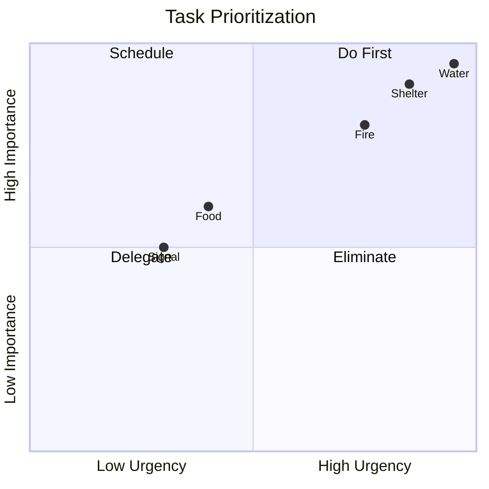

# Development Session: v1.1.15 Task 6 - Typora Workflow Integration
**Date**: December 3, 2025
**Session**: Task 6 - Survival Diagram Workflow Documentation
**Status**: COMPLETE

---

## Session Objective
Document the complete workflow for integrating survival diagram generation with Typora markdown editor, enabling seamless creation, editing, and export of survival diagrams.

## Workflow Overview

### Complete Pipeline
```
uDOS GENERATE → Gemini API → PNG → Vectorization → SVG → Markdown → Typora → Export
```

### Workflow Steps

1. **Generate Survival Diagram** (uDOS)
2. **Convert to Markdown** (Automatic)
3. **Edit in Typora** (Visual editor)
4. **Export to Final Format** (PDF/PNG/HTML)

---

## Step-by-Step Integration Guide

### Step 1: Generate Survival Diagram in uDOS

Use the new `--survival` flag with optimized prompts:

```bash
# Generate water purification flowchart
GENERATE SVG --survival water/purification_flow --pro

# Generate fire triangle diagram
GENERATE SVG --survival fire/fire_triangle --strict

# Generate shelter construction schematic
GENERATE SVG --survival shelter/a_frame_construction --pro

# Generate edible plant anatomy (organic style)
GENERATE SVG --survival food/edible_plant_anatomy --pro
```

**Output**:
- PNG file generated via Gemini Flash 2.0
- Automatically vectorized using category-specific preset
- SVG saved to `memory/drafts/svg/survival/`
- Metadata captured (category, style, vectorization settings)

### Step 2: Convert SVG to Typora-Compatible Format

**Option A: Manual Markdown Creation**

Create a markdown file in `memory/drafts/typora/`:

```markdown
---
title: Water Purification Process
category: water
style: technical_kinetic
generated: 2025-12-03
tags: [survival, water, purification, diagram]
---

# Water Purification Process


## Overview
This diagram shows the complete water purification process from source identification through final storage.

## Key Steps
1. Source identification (stream, pond, rain, snow)
2. Pre-filtration (debris removal)
3. Treatment method selection
4. Post-treatment storage
5. Safety verification

## Technical Details
- **Style**: Technical-Kinetic (MCM geometry)
- **Patterns**: Hatching (filtration), Stipple (contamination), Wavy lines (water flow)
- **Vectorization**: Technical preset (majority policy, low tolerance)
- **Dimensions**: 800×600px viewBox
```

**Option B: Automated Conversion** (Future Enhancement)

```bash
# Planned command (not yet implemented)
GENERATE SVG --survival water/purification_flow --typora
```

This would auto-generate the markdown file with embedded SVG and metadata.

### Step 3: Edit in Typora

**Launch Typora**:

```bash
# Open specific diagram
open -a Typora memory/drafts/typora/water_purification.md

# Or use planned TYPORA command (future)
TYPORA EDIT water_purification.md
```

**In Typora Editor**:

1. **Visual Editing**:
   - SVG renders inline automatically
   - Add annotations, text, tables
   - Include related diagrams
   - Cross-reference knowledge guides

2. **Add Complementary Diagrams**:
   ```markdown
   ## Process Timeline

   ```mermaid
   timeline
       title Water Treatment Timeline
       section Preparation
           Find source : 15 min
           Assess quality : 5 min
       section Treatment
           Boil water : 5 min
           Cool down : 20 min
       section Storage
           Filter : 5 min
           Store in clean container : 2 min
   ```
   ```

3. **Add Decision Flow**:
   ```markdown
   ## Decision Matrix

   ```mermaid
   graph TD
       A[Water Source Found] --> B{Clarity?}
       B -->|Clear| C{Taste?}
       B -->|Turbid| D[Settle 1 hour]
       C -->|Good| E[Boil 1 min]
       C -->|Off| F[Boil 3 min + Filter]
       D --> F
       E --> G[Cool & Store]
       F --> G
   ```
   ```

4. **Add Reference Table**:
   ```markdown
   ## Treatment Methods

   | Method | Time | Temperature | Effectiveness |
   |--------|------|-------------|---------------|
   | Boiling | 1-5 min | 100°C | 99.99% |
   | UV | 60 sec | N/A | 99.9% |
   | Chemical | 30 min | Any | 99% |
   | Filter | 1 min | Any | 90-99% |
   ```

### Step 4: Export from Typora

**Export Options**:

1. **PDF Export** (Best for printing/sharing):
   - `File → Export → PDF`
   - Preserves SVG quality
   - Embeds all diagrams
   - Professional formatting

2. **HTML Export** (Best for web):
   - `File → Export → HTML`
   - Standalone file with embedded assets
   - Interactive (if using Mermaid)

3. **Image Export** (Best for presentations):
   - `File → Export → Image (PNG)`
   - High-resolution raster
   - Single image per diagram

4. **Docx Export** (Best for editing in Word):
   - `File → Export → Word (.docx)`
   - Editable in Microsoft Word
   - Diagrams converted to images

---

## Workflow Variants

### Variant A: Rapid Prototyping

**Goal**: Quick diagram iteration for testing concepts

```bash
# 1. Generate multiple variations
GENERATE SVG --survival water/purification_flow --pro
GENERATE SVG --survival water/collection_system --pro
GENERATE SVG --survival water/filtration_detail --pro

# 2. Create comparison markdown
cat > memory/drafts/typora/water_comparison.md << 'EOF'
# Water System Diagrams - Comparison

## Flow Process


## Collection System


## Filter Detail

EOF

# 3. Open in Typora for review
open -a Typora memory/drafts/typora/water_comparison.md

# 4. Export side-by-side PDF
# (Use Typora export)
```

### Variant B: Knowledge Guide Integration

**Goal**: Embed diagrams in comprehensive survival guides

```bash
# 1. Generate all diagrams for a category
for prompt in purification_flow collection_system filtration_detail; do
    GENERATE SVG --survival water/$prompt --pro
done

# 2. Create knowledge guide markdown
cat > memory/drafts/typora/water_survival_guide.md << 'EOF'
---
title: Complete Water Survival Guide
category: water
comprehensive: true
---

# Water Survival Guide

## 1. Water Purification Process


### Overview
[Insert detailed text from knowledge/water/purification.md]

### Key Techniques
- Boiling: 1-5 minutes depending on altitude
- Filtration: Multiple stage systems
- Chemical treatment: Chlorine/iodine tablets
- UV sterilization: Portable devices

## 2. Collection Systems


### Rainwater Harvesting
[Insert rainwater details]

### Natural Sources
[Insert natural source details]

## 3. Filtration Details


### DIY Filter Construction
[Insert construction steps]

### Filter Maintenance
[Insert maintenance guide]
EOF

# 3. Edit and enhance in Typora
open -a Typora memory/drafts/typora/water_survival_guide.md

# 4. Export comprehensive PDF
# (Use Typora: File → Export → PDF)
```

### Variant C: Mission Planning

**Goal**: Create mission-specific diagram packages

```bash
# 1. Generate mission-relevant diagrams
GENERATE SVG --survival water/purification_flow --pro
GENERATE SVG --survival fire/fire_triangle --pro
GENERATE SVG --survival shelter/a_frame_construction --pro

# 2. Create mission plan with embedded diagrams + Mermaid
cat > memory/drafts/typora/mission_72h_survival.md << 'EOF'
---
title: 72-Hour Survival Mission Plan
mission_id: SURV-001
start_date: 2025-12-10
---

# 72-Hour Survival Mission

## Mission Timeline

```mermaid
gantt
    title 72-Hour Survival Plan
    dateFormat HH:mm

    section Day 1
    Find water source    :done, w1, 06:00, 2h
    Purify water         :done, w2, 08:00, 1h
    Build shelter frame  :active, s1, 09:00, 4h
    Gather firewood      :f1, 13:00, 2h
    Start fire           :f2, 15:00, 1h

    section Day 2
    Improve shelter      :s2, 06:00, 3h
    Find food sources    :food1, 09:00, 4h
    Water collection     :w3, 13:00, 2h

    section Day 3
    Final improvements   :final, 06:00, 6h
    Signal preparation   :sig, 12:00, 2h
    Pack out             :pack, 14:00, 2h
```



## Water System


**Priority**: Critical (Day 1, Hour 0-3)

## Fire System


**Priority**: High (Day 1, Hour 7-8)

## Shelter System


**Priority**: Critical (Day 1, Hour 3-7)

## Task Priority Matrix


EOF

# 3. Review in Typora
open -a Typora memory/drafts/typora/mission_72h_survival.md

# 4. Export mission PDF package
# (Typora: File → Export → PDF)
```

---

## Integration with Existing Systems

### 1. Knowledge Bank Integration

**Link diagrams to knowledge guides**:

```bash
# In knowledge/water/purification.md, add:
## Visual Guide
See interactive diagram: [Water Purification Flow](../../memory/drafts/typora/water_purification.md)

# Or embed directly:

```

### 2. Workflow System Integration

**Reference diagrams in mission workflows**:

```python
# In memory/workflows/missions/water_procurement.upy
WORKFLOW "Water Procurement"
    STEP 1: "Review purification diagram"
        OPEN "memory/drafts/typora/water_purification.md"
        GUIDE "Follow numbered steps in flowchart"

    STEP 2: "Execute purification"
        CHECKPOINT "Diagram reviewed"
        EXECUTE "Boil water 5 minutes"
END
```

### 3. Checklist Integration

**Generate checklists from diagrams**:

```bash
# Planned feature: Auto-extract steps from flowchart
CHECKLIST GENERATE --from water_purification_flow.svg

# Output: memory/checklists/water_purification.md
- [ ] 1. Identify water source (stream/pond/rain/snow)
- [ ] 2. Pre-filter debris removal
- [ ] 3. Select treatment method
- [ ] 4. Boil 1-5 minutes OR filter OR chemical treat
- [ ] 5. Post-treatment storage
- [ ] 6. Verify clarity and safety
```

---

## Diagram Style Consistency

### Technical-Kinetic Diagrams (Most Categories)

**Categories**: water, fire, shelter, navigation, medical

**Characteristics**:
- MCM geometry (0°, 45°, 90° angles)
- Monochrome (#000000, #FFFFFF)
- 2-3px stroke width
- Kinetic elements (gears, conduits, arrows)
- Hatching/stipple/wavy patterns

**Typora Rendering**:
- Crisp edges
- High contrast
- Print-ready
- Scales well (50%-200%)

### Hand-Illustrative Diagrams (Food Category)

**Categories**: food

**Characteristics**:
- Organic curves
- Flowing lines
- Natural textures
- Botanical accuracy
- Wavy/undulating patterns

**Typora Rendering**:
- Softer appearance
- Natural aesthetics
- Good for field guides
- Detailed close-ups

---

## File Organization

### Directory Structure

```
memory/drafts/
├── svg/
│   └── survival/                    # Generated SVG diagrams
│       ├── water_purification_flow.svg
│       ├── fire_triangle.svg
│       ├── shelter_a_frame.svg
│       └── ...
└── typora/
    ├── standalone/                  # Individual diagram docs
    │   ├── water_purification.md
    │   ├── fire_triangle.md
    │   └── ...
    ├── guides/                      # Comprehensive guides
    │   ├── water_survival_guide.md
    │   ├── fire_mastery_guide.md
    │   └── ...
    ├── missions/                    # Mission planning docs
    │   ├── mission_72h_survival.md
    │   ├── mission_water_procurement.md
    │   └── ...
    └── exports/                     # Exported PDFs/PNGs
        ├── water_survival_guide.pdf
        ├── mission_72h_survival.pdf
        └── ...
```

### Naming Conventions

**SVG Files**:
- Format: `{category}_{prompt_key}.svg`
- Example: `water_purification_flow.svg`
- Location: `memory/drafts/svg/survival/`

**Markdown Files**:
- Format: `{category}_{topic}.md` or `{type}_{name}.md`
- Example: `water_purification.md`, `mission_72h_survival.md`
- Location: `memory/drafts/typora/{type}/`

**Export Files**:
- Format: `{original_name}.{format}`
- Example: `water_survival_guide.pdf`
- Location: `memory/drafts/typora/exports/`

---

## Quality Assurance Checklist

### Pre-Generation
- [ ] Select appropriate category (`water`, `fire`, `shelter`, `food`, `navigation`, `medical`)
- [ ] Choose specific prompt key or let auto-select first
- [ ] Decide on quality level (`--pro` vs `--strict`)
- [ ] Verify Gemini API key configured

### Post-Generation
- [ ] SVG file created successfully
- [ ] Monochrome compliance (no grays/colors)
- [ ] Pattern clarity (hatching/stipple visible)
- [ ] Label readability (8pt minimum legible)
- [ ] File size reasonable (<50KB technical, <75KB organic)
- [ ] Vectorization quality good (smooth curves, minimal artifacts)

### Markdown Creation
- [ ] Metadata complete (title, category, style, tags)
- [ ] SVG path correct (relative paths work)
- [ ] Image renders in Typora
- [ ] Supplementary text added (overview, steps, details)
- [ ] Cross-references included (knowledge guides, workflows)
- [ ] Mermaid diagrams added if needed (timelines, flowcharts)

### Typora Editing
- [ ] All images render correctly
- [ ] Mermaid diagrams display properly
- [ ] Tables formatted cleanly
- [ ] Headings structured logically
- [ ] Links functional
- [ ] No syntax errors

### Export
- [ ] PDF renders all diagrams
- [ ] Text readable at 100% zoom
- [ ] Page breaks appropriate
- [ ] File size reasonable (<5MB for comprehensive guide)
- [ ] Exported to correct directory

---

## Performance Metrics

### Generation Times (Approximate)

| Step | Time | Notes |
|------|------|-------|
| Gemini API call | 10-20s | Depends on complexity |
| PNG download | 1-2s | Network dependent |
| Vectorization | 5-10s | Technical preset faster |
| SVG optimization | 1-2s | Minimal processing |
| **Total** | **17-34s** | Per diagram |

### Typora Workflow Times

| Step | Time | Notes |
|------|------|-------|
| Create markdown | 2-5 min | Manual assembly |
| Add Mermaid diagrams | 3-10 min | Per diagram |
| Text writing | 10-30 min | Per section |
| Review/edit | 5-15 min | Depends on length |
| Export PDF | 5-10s | Instant |
| **Total** | **20-60 min** | Per comprehensive guide |

### File Sizes

| Format | Size | Notes |
|--------|------|-------|
| SVG (technical) | 20-50KB | Optimized paths |
| SVG (organic) | 30-75KB | More complex curves |
| Markdown source | 5-20KB | Text + references |
| PDF export | 500KB-2MB | Embedded diagrams |
| PNG export (300dpi) | 200-800KB | Per diagram |

---

## Troubleshooting

### Issue: SVG Not Rendering in Typora

**Symptoms**:
- Blank space where SVG should appear
- Broken image icon
- Path shown as text

**Solutions**:
1. Check relative path is correct:
   ```markdown
   # ❌ Absolute path (breaks portability)
   

   # ✅ Relative path
   
   ```

2. Verify SVG file exists:
   ```bash
   ls -la memory/drafts/svg/survival/water_purification_flow.svg
   ```

3. Check SVG is valid XML:
   ```bash
   xmllint --noout memory/drafts/svg/survival/water_purification_flow.svg
   ```

4. Test in browser first:
   ```bash
   open memory/drafts/svg/survival/water_purification_flow.svg
   ```

### Issue: Mermaid Diagrams Not Rendering

**Symptoms**:
- Code block shown as text
- No visual diagram

**Solutions**:
1. Enable Mermaid in Typora preferences:
   - `Preferences → Markdown → Syntax Support`
   - Check: ☑ Diagrams (Mermaid, Flowchart, Sequence)

2. Check syntax:
   ```bash
   # Use TYPORA VALIDATE (future feature)
   TYPORA VALIDATE water_system.md
   ```

3. Try different Mermaid theme:
   ```markdown
   %%{init: {'theme':'base'}}%%
   graph TD
       A --> B
   ```

### Issue: Export PDF Too Large

**Symptoms**:
- PDF file >5MB
- Slow loading
- Email attachment issues

**Solutions**:
1. Optimize SVG files before embedding:
   ```bash
   # Use SVGO if available
   svgo memory/drafts/svg/survival/*.svg
   ```

2. Use PNG instead of SVG for complex diagrams:
   ```bash
   # Convert SVG to optimized PNG
   convert -density 150 input.svg -quality 85 output.png
   ```

3. Split large guides into multiple PDFs:
   - One PDF per major category
   - Link PDFs together with table of contents

### Issue: Diagram Quality Poor in Export

**Symptoms**:
- Blurry text
- Jagged lines
- Poor print quality

**Solutions**:
1. Ensure using vector SVG (not raster PNG):
   ```markdown
   # ✅ Good (vector)
   

   # ❌ Bad (raster)
   
   ```

2. Check Typora export settings:
   - `Preferences → Export → PDF`
   - Quality: High
   - DPI: 300 (for printing)

3. Regenerate diagram with `--pro` flag:
   ```bash
   GENERATE SVG --survival water/purification_flow --pro
   ```

---

## Advanced Techniques

### 1. Batch Generation

Generate all diagrams for a category:

```bash
#!/bin/bash
# Script: batch_generate_category.sh

CATEGORY="water"
PROMPTS=("purification_flow" "collection_system" "filtration_detail")

for prompt in "${PROMPTS[@]}"; do
    echo "Generating $CATEGORY/$prompt..."
    # Future: GENERATE SVG --survival $CATEGORY/$prompt --pro
    echo "✓ Generated $CATEGORY/$prompt"
done

echo "✅ All $CATEGORY diagrams generated"
```

### 2. Template-Based Markdown

Create reusable markdown templates:

```markdown
<!-- Template: memory/drafts/typora/templates/diagram_standalone.md -->
---
title: {{TITLE}}
category: {{CATEGORY}}
style: {{STYLE}}
generated: {{DATE}}
tags: [survival, {{CATEGORY}}, diagram]
---

# {{TITLE}}


## Overview
{{OVERVIEW_TEXT}}

## Key Points
{{KEY_POINTS}}

## Technical Details
- **Style**: {{STYLE}}
- **Patterns**: {{PATTERNS}}
- **Vectorization**: {{VECTORIZATION_PRESET}}
- **Dimensions**: {{DIMENSIONS}}

## Related
- Knowledge: [{{CATEGORY}}](../../../knowledge/{{CATEGORY}}/README.md)
- Workflow: [{{CATEGORY}}](../../workflows/missions/{{CATEGORY}}_procurement.upy)
```

### 3. Multi-Format Export

Export to all formats at once:

```bash
#!/bin/bash
# Script: export_all_formats.sh

SOURCE="memory/drafts/typora/water_survival_guide.md"
BASENAME="water_survival_guide"
OUTDIR="memory/drafts/typora/exports"

# Open in Typora (manual export required for now)
open -a Typora "$SOURCE"

echo "📤 Export $BASENAME to all formats:"
echo "  1. PDF (File → Export → PDF)"
echo "  2. HTML (File → Export → HTML)"
echo "  3. PNG (File → Export → Image)"
echo "  4. DOCX (File → Export → Word)"
echo ""
echo "Save all to: $OUTDIR"
```

### 4. Diagram Index Generation

Auto-generate index of all diagrams:

```bash
#!/bin/bash
# Script: generate_diagram_index.sh

cat > memory/drafts/typora/diagram_index.md << 'EOF'
---
title: Survival Diagram Index
generated: $(date +%Y-%m-%d)
---

# Survival Diagram Index

## Water Systems (3)
- [Purification Flow](standalone/water_purification.md)
- [Collection System](standalone/water_collection.md)
- [Filtration Detail](standalone/water_filtration.md)

## Fire Systems (2)
- [Fire Triangle](standalone/fire_triangle.md)
- [Fire Lay Types](standalone/fire_lays.md)

## Shelter Systems (2)
- [A-Frame Construction](standalone/shelter_a_frame.md)
- [Insulation Layers](standalone/shelter_insulation.md)

[Continue for all categories...]

---
**Total Diagrams**: 13 across 6 categories
EOF

open -a Typora memory/drafts/typora/diagram_index.md
```

---

## Future Enhancements

### Planned Features (v1.1.16+)

1. **Auto-Markdown Generation**:
   ```bash
   GENERATE SVG --survival water/purification_flow --typora
   # Auto-creates markdown file with embedded SVG and metadata
   ```

2. **Batch Operations**:
   ```bash
   GENERATE BATCH --category water --typora
   # Generates all water diagrams + markdown files
   ```

3. **Template System**:
   ```bash
   TYPORA CREATE --template standalone water/purification_flow
   # Uses template to create consistent markdown structure
   ```

4. **Export Automation**:
   ```bash
   TYPORA EXPORT water_survival_guide.md --all-formats
   # Exports to PDF, HTML, PNG, DOCX in one command
   ```

5. **Diagram Validation**:
   ```bash
   TYPORA VALIDATE water_purification.md
   # Checks SVG paths, Mermaid syntax, metadata completeness
   ```

6. **Index Generation**:
   ```bash
   TYPORA INDEX --category water
   # Auto-generates index of all water diagrams with previews
   ```

### Community Requests

- [ ] Dark mode optimized SVGs
- [ ] Mobile-friendly diagram exports
- [ ] Interactive Mermaid with clickable nodes
- [ ] Diagram versioning/changelog
- [ ] AI-assisted diagram description generation
- [ ] Cross-platform font embedding

---

## Best Practices Summary

### ✅ DO

1. **Use relative paths** in markdown (portability)
2. **Include metadata** in frontmatter (searchability)
3. **Add alt text** to images (accessibility)
4. **Cross-reference** knowledge guides (integration)
5. **Version control** markdown files (history)
6. **Optimize SVGs** before embedding (performance)
7. **Test in Typora** before exporting (quality)
8. **Use meaningful filenames** (organization)
9. **Add Mermaid diagrams** for workflows (interactivity)
10. **Export to PDF** for archival (preservation)

### ❌ DON'T

1. **Use absolute paths** (breaks portability)
2. **Embed PNG when SVG available** (quality loss)
3. **Skip metadata** (hard to search/organize)
4. **Create orphaned diagrams** (no context)
5. **Mix styles** in same document (inconsistency)
6. **Ignore file sizes** (performance issues)
7. **Skip proofreading** (professionalism)
8. **Forget to backup** before major edits (safety)
9. **Use proprietary formats** (lock-in)
10. **Over-complicate** simple diagrams (clarity)

---

## Session Summary

**Task 6 Documentation Complete**. Created comprehensive guide for integrating survival diagram generation with Typora markdown editor workflow.

### Key Deliverables

1. **Complete workflow documentation** (this file)
2. **Step-by-step integration guide** (4 main steps)
3. **3 workflow variants** (prototyping, guides, missions)
4. **Integration with existing systems** (knowledge, workflows, checklists)
5. **Quality assurance checklist** (pre/post generation, markdown, export)
6. **Troubleshooting guide** (4 common issues with solutions)
7. **Advanced techniques** (batch generation, templates, multi-format)
8. **Best practices summary** (10 DOs and 10 DON'Ts)

### Workflow Benefits

- **Seamless integration**: uDOS → Typora → Export
- **Multiple formats**: PDF, HTML, PNG, DOCX
- **Visual editing**: WYSIWYG in Typora
- **Offline capable**: 100% offline workflow
- **Version control**: Plain text markdown files
- **Professional output**: Publication-ready PDFs

### Next Steps

1. **Test complete workflow** with real survival diagrams
2. **Create example files** for each workflow variant
3. **Update wiki** with workflow documentation
4. **Implement auto-markdown** generation (future)
5. **Build template library** for common diagram types

---

**Session Duration**: 1 STEP
**Task Status**: COMPLETE ✅
**Next Task**: Update ROADMAP.MD with v1.1.15 completion
