# Typora Diagram Support Extension

**Version**: 1.0.0
**Category**: Graphics
**Offline**: ✅ Yes

---

## Overview

Provides extended diagram syntax support for [Typora](https://typora.io/) markdown editor, enabling rich diagram creation within markdown files with offline rendering capabilities.

Typora natively supports multiple diagram formats that render directly in the editor without requiring external tools or internet connection. This extension provides uDOS integration for creating and managing these diagrams.

---

## Supported Diagram Types

### 1. **Mermaid Diagrams** (12 types)
- Flowcharts
- Sequence diagrams
- Gantt charts
- Class diagrams
- State diagrams
- Pie charts
- Mindmaps
- Gitgraph (commit flow)
- Timeline charts
- Quadrant charts
- Sankey diagrams
- XY charts

### 2. **js-sequence Diagrams**
- Sequence diagrams with simple syntax
- Two themes: `simple` and `hand-drawn`

### 3. **Flowcharts** (flowchart.js)
- Traditional flowchart syntax
- Decision diamonds, process boxes, terminals

### 4. **C4/PlantUML Diagrams**
- Component diagrams
- Class diagrams
- Use case diagrams
- Sequence diagrams

---

## Installation

### Prerequisites
1. **Typora** - Download from [typora.io](https://typora.io/)
2. Enable diagram support in Typora preferences:
   - `Preferences → Markdown → Syntax Support`
   - Check: Diagrams, Mermaid, Sequence, Flowchart

### uDOS Extension Setup
```bash
# Extension is already in extensions/core/typora-diagrams/
# Commands are available immediately
TYPORA CREATE flowchart "Water System"
```

---

## Usage

### Basic Workflow

1. **Create diagram in uDOS**
```bash
TYPORA CREATE flowchart "Water Purification Process"
```

2. **Edit in Typora**
```bash
# Opens Typora with the generated markdown file
TYPORA EDIT memory/drafts/typora/water_purification.md
```

3. **Export to PDF/HTML**
```bash
TYPORA EXPORT water_purification.md --format pdf
```

---

## Diagram Syntax Examples

### Mermaid Flowchart
````markdown
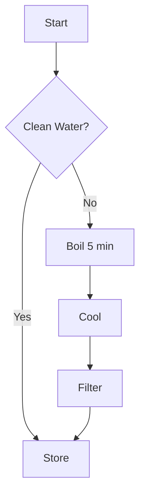
````

### Mermaid Sequence Diagram
````markdown
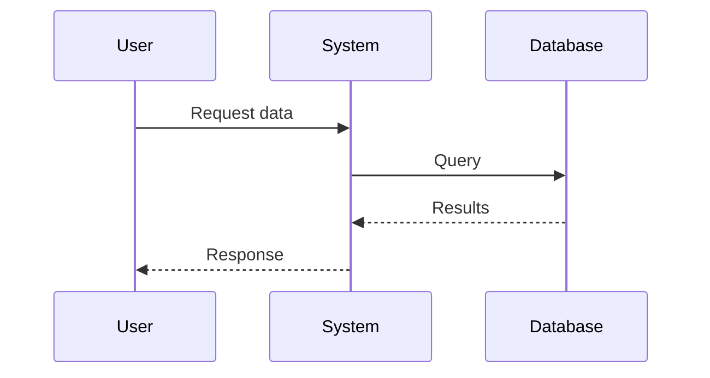
````

### Mermaid Gantt Chart
````markdown
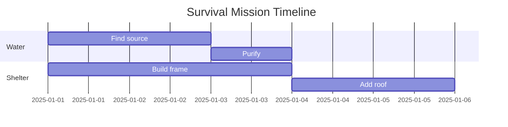
````

### Mermaid Class Diagram
````markdown
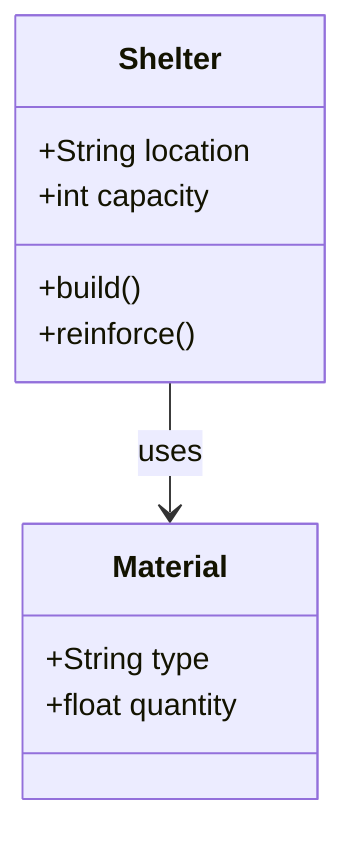
````

### Mermaid State Diagram
````markdown
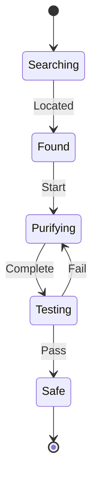
````

### Mermaid Pie Chart
````markdown
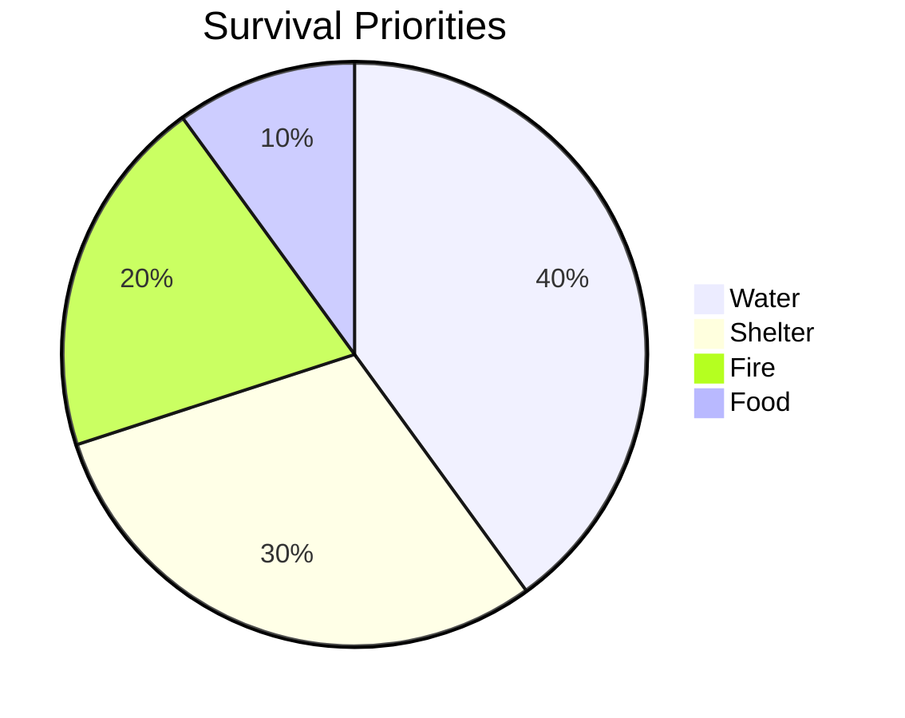
````

### Mermaid Mindmap
````markdown
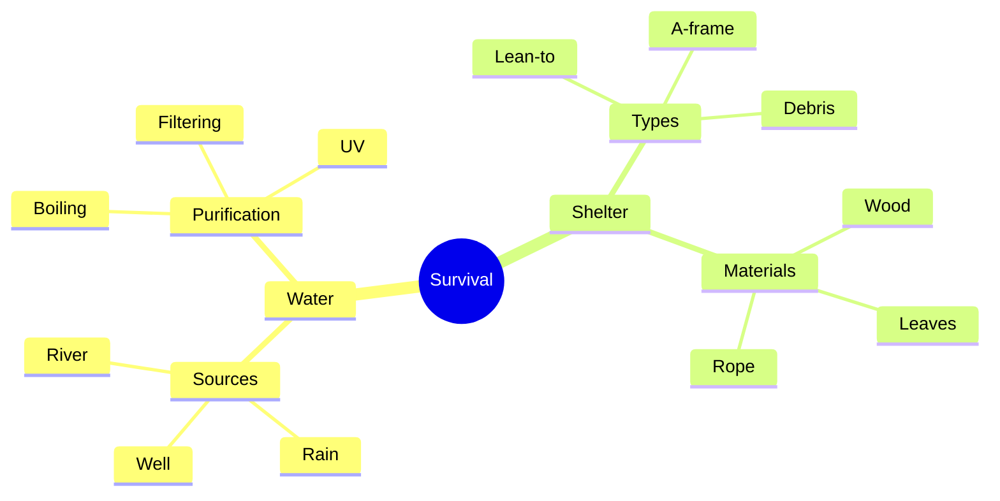
````

### Mermaid Gitgraph
````markdown
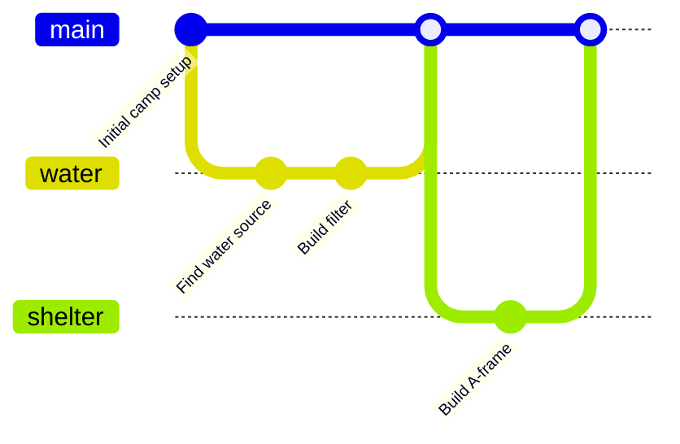
````

### Mermaid Timeline
````markdown
```mermaid
timeline
    title Survival Day 1
    section Morning
        06:00 : Wake up
        07:00 : Find water
        08:00 : Boil water
    section Afternoon
        12:00 : Build shelter
        15:00 : Gather firewood
    section Evening
        18:00 : Start fire
        19:00 : Prepare food
        21:00 : Sleep
```
````

### Mermaid Quadrant Chart
````markdown
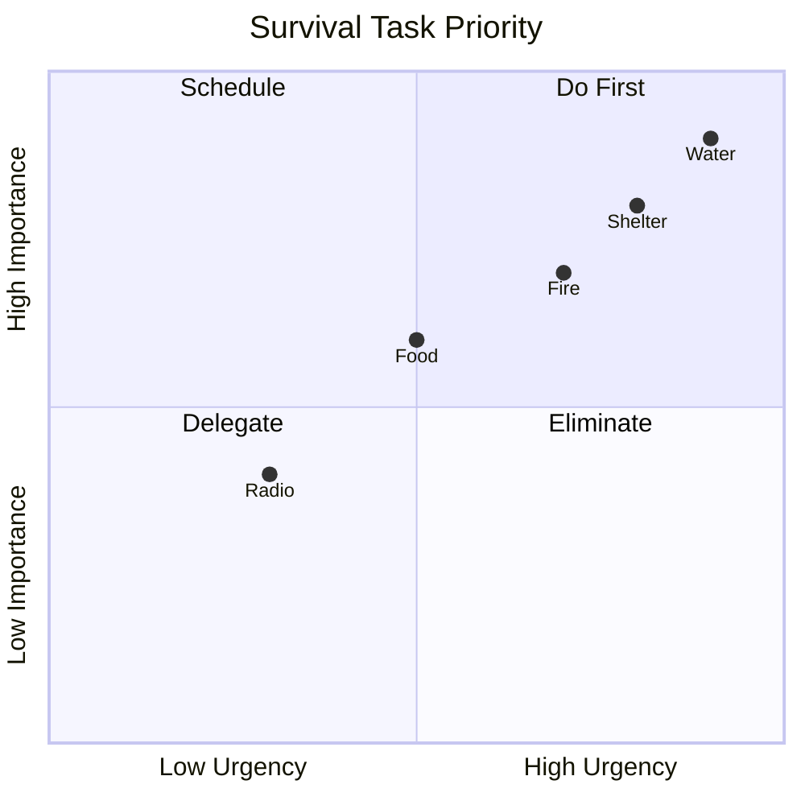
````

### Mermaid Sankey Diagram
````markdown
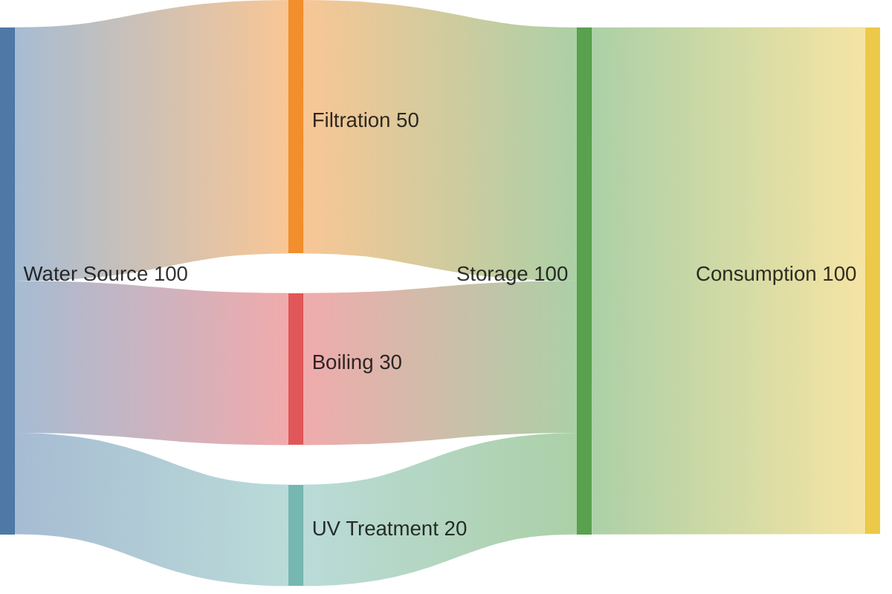
````

### Mermaid XY Chart
````markdown
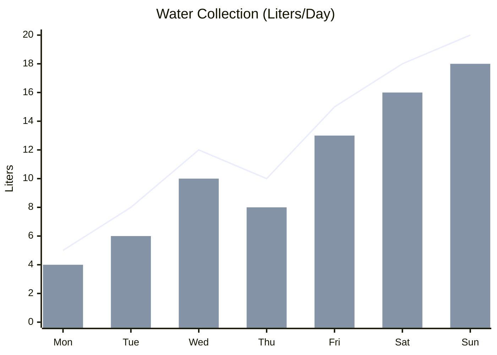
````

### js-sequence Diagram (Simple Theme)
````markdown
```sequence
Title: Fire Starting Process

User->Tinder: Prepare
Tinder->Kindling: Ignite
Kindling->Fuel: Add
Fuel->Fire: Sustain
Fire-->User: Heat
```
````

### js-sequence Diagram (Hand-drawn Theme)
````markdown
```sequence-hand
User->Shelter: Enter
Shelter->Storage: Check supplies
Storage-->Shelter: Inventory
Shelter-->User: Status report
```
````

### Flowchart (flowchart.js)
````markdown
```flow
st=>start: Start
check=>condition: Water safe?
boil=>operation: Boil 5 minutes
filter=>operation: Filter
store=>operation: Store
e=>end: Ready to drink

st->check
check(yes)->store->e
check(no)->boil->filter->store
```
````

---

## Commands

### TYPORA CREATE
Create a new diagram file for Typora editing.

**Syntax**:
```bash
TYPORA CREATE <type> <title> [--style <style>] [--save <filename>]
```

**Types**:
- `flowchart`, `sequence`, `gantt`, `class`, `state`, `pie`
- `mindmap`, `gitgraph`, `timeline`, `quadrant`, `sankey`, `xychart`
- `js-sequence`, `js-sequence-hand`, `flow`

**Examples**:
```bash
TYPORA CREATE flowchart "Water System"
TYPORA CREATE sequence "Mission Timeline"
TYPORA CREATE gantt "Build Schedule" --save shelter_plan.md
```

### TYPORA CONVERT
Convert existing diagrams to Typora-compatible markdown.

**Syntax**:
```bash
TYPORA CONVERT <source> [--format <format>] [--output <file>]
```

**Formats**: `mermaid`, `sequence`, `flow`, `plantuml`

**Examples**:
```bash
TYPORA CONVERT diagram.mmd --format mermaid
TYPORA CONVERT flow.txt --format flowchart
```

### TYPORA EXPORT
Export Typora diagram to other formats.

**Syntax**:
```bash
TYPORA EXPORT <file> [--format <format>] [--output <path>]
```

**Formats**: `pdf`, `html`, `png`, `svg`

**Examples**:
```bash
TYPORA EXPORT water_system.md --format pdf
TYPORA EXPORT shelter_plan.md --format png
```

### TYPORA VALIDATE
Validate diagram syntax before opening in Typora.

**Syntax**:
```bash
TYPORA VALIDATE <file>
```

**Examples**:
```bash
TYPORA VALIDATE water_system.md
```

### TYPORA LIST
List available diagram templates and examples.

**Syntax**:
```bash
TYPORA LIST [--type <type>] [--category <category>]
```

**Examples**:
```bash
TYPORA LIST --type flowchart
TYPORA LIST --category survival
```

### TYPORA EXAMPLES
Show example diagrams with syntax.

**Syntax**:
```bash
TYPORA EXAMPLES [<type>]
```

**Examples**:
```bash
TYPORA EXAMPLES flowchart
TYPORA EXAMPLES sequence
TYPORA EXAMPLES all
```

---

## Output Directories

```
memory/drafts/typora/
├── flowcharts/          # Flowchart diagrams
├── sequence/            # Sequence diagrams
├── gantt/               # Gantt charts
├── class/               # Class diagrams
├── state/               # State diagrams
├── pie/                 # Pie charts
├── mindmap/             # Mindmaps
├── gitgraph/            # Commit flow graphs
├── timeline/            # Timeline charts
├── quadrant/            # Quadrant charts
├── sankey/              # Sankey diagrams
├── xychart/             # XY charts
└── exports/             # Exported PDFs/PNGs
```

---

## Integration with uDOS Systems

### Knowledge Guides
Add diagrams to survival guides:

```markdown
# Water Purification

## Process Flow

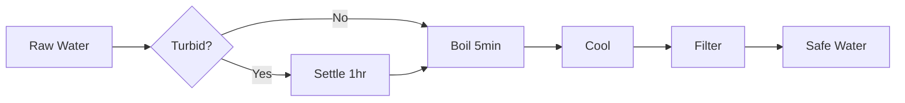

## Timeline

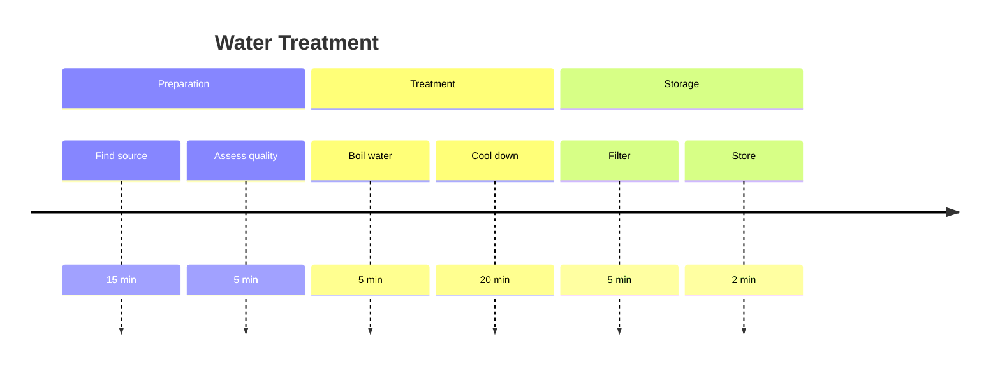
````

### Mission Workflows
Visualize mission progress:

```markdown
# Mission: Establish Camp

```mermaid
gantt
    title Camp Setup Timeline
    dateFormat HH:mm

    section Water
    Find source    :done, w1, 06:00, 1h
    Purify         :done, w2, after w1, 30min

    section Shelter
    Build frame    :active, s1, 07:00, 2h
    Add roof       :s2, after s1, 1h

    section Fire
    Gather wood    :f1, 08:00, 1h
    Start fire     :f2, after f1, 30min
```
````

### System Documentation
Document architecture with C4/PlantUML:

```markdown
# uDOS Architecture

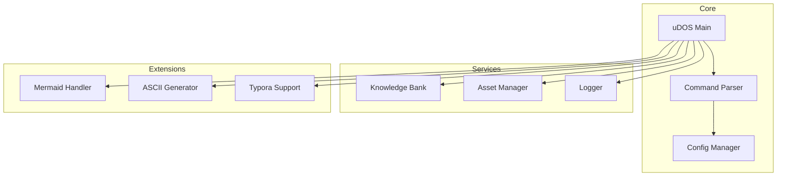
````

---

## Advantages Over Other Systems

### vs. Mermaid CLI
- ✅ Visual editor (Typora WYSIWYG)
- ✅ Offline rendering
- ✅ Multiple syntax options
- ✅ Direct PDF export
- ✅ No Node.js required

### vs. PlantUML
- ✅ Simpler syntax
- ✅ Faster rendering
- ✅ Better markdown integration
- ✅ No Java required

### vs. Draw.io
- ✅ Text-based (version control friendly)
- ✅ Lightweight files
- ✅ Easier collaboration
- ✅ Better for documentation

### vs. ASCII Diagrams
- ✅ More visual polish
- ✅ Color support
- ✅ Complex layouts
- ✅ Professional output

---

## Typora Preferences

### Enable All Diagram Types

1. Open Typora Preferences (`⌘,` on macOS)
2. Go to **Markdown** tab
3. Under **Syntax Support**, enable:
   - ☑ Diagrams (Mermaid, Flowchart, Sequence)
   - ☑ Inline Math
   - ☑ Subscript
   - ☑ Superscript
   - ☑ Highlight

### Recommended Themes for Diagrams
- **Light**: GitHub, Newsprint, Pixyll
- **Dark**: Night, Dracula, Vue

---

## Examples Directory

Pre-built examples in `extensions/core/typora-diagrams/examples/`:

1. **survival_flowchart.md** - Water purification process
2. **mission_gantt.md** - 7-day survival mission timeline
3. **system_sequence.md** - Emergency response sequence
4. **knowledge_mindmap.md** - Survival knowledge hierarchy
5. **progress_timeline.md** - Daily camp progress
6. **priority_quadrant.md** - Task prioritization matrix
7. **resource_sankey.md** - Resource flow diagram
8. **metrics_xychart.md** - Performance tracking

---

## File Format Specification

### Markdown Header
All Typora diagrams should include metadata:

```markdown
---
title: Water Purification System
author: uDOS
date: 2025-12-02
tags: [survival, water, diagram]
typora-root-url: ./
typora-copy-images-to: ./images
---

# Water Purification System

[Diagram content here]
```

### Code Block Syntax
All diagrams use triple backticks with language identifier:

```
```mermaid
[Mermaid diagram]
```

```sequence
[js-sequence diagram]
```

```flow
[Flowchart.js diagram]
```
```

---

## Performance

- **Rendering**: Real-time in Typora editor
- **Export**: < 5 seconds for PDF
- **File size**: < 10KB for most diagrams
- **Offline**: 100% offline capable

---

## Troubleshooting

### Diagram Not Rendering in Typora

1. Check syntax with `TYPORA VALIDATE`
2. Ensure diagram type is enabled in preferences
3. Try different Typora theme
4. Restart Typora

### Export Fails

1. Verify Typora is installed
2. Check output directory permissions
3. Update Typora to latest version
4. Try alternative export format

### Syntax Errors

Use `TYPORA VALIDATE` to check:
```bash
TYPORA VALIDATE my_diagram.md

# Output:
✅ Syntax valid
⚠️  Warning: Long labels may wrap
📊 Diagram type: mermaid flowchart
📄 Lines: 42
```

---

## Best Practices

### 1. Keep Diagrams Simple
- Max 15-20 nodes per flowchart
- Use subgraphs for organization
- Limit nesting depth to 3 levels

### 2. Use Descriptive Labels
```mermaid
# ❌ Bad
A --> B

# ✅ Good
FindWater[Find Water Source] --> PurifyWater[Boil for 5 minutes]
```

### 3. Add Comments
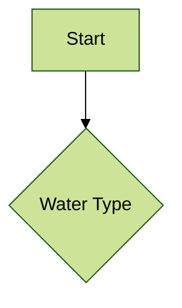

### 4. Version Control
- Save all diagrams in `memory/drafts/typora/`
- Use meaningful filenames: `water_purification_v2.md`
- Include date in metadata

### 5. Cross-Reference
Link diagrams to knowledge guides:
```markdown
See diagram: [Water System](../typora/water_system.md)
```

---

## Future Enhancements

### Planned Features
- [ ] Auto-generate diagrams from uCODE scripts
- [ ] Batch export all diagrams
- [ ] Diagram templates per knowledge category
- [ ] Interactive diagram editor in uDOS
- [ ] Diagram versioning and diff
- [ ] AI-assisted diagram generation

### Community Contributions
- Submit diagram templates to `memory/shared/diagrams/`
- Share Typora themes optimized for survival content
- Create diagram libraries per knowledge domain

---

## Resources

### Documentation
- [Typora Diagrams Guide](https://support.typora.io/Draw-Diagrams-With-Markdown/)
- [Mermaid.js Docs](https://mermaid.js.org/)
- [js-sequence Diagrams](https://bramp.github.io/js-sequence-diagrams/)
- [Flowchart.js](http://flowchart.js.org/)

### uDOS Integration
- See: `wiki/Graphics-System.md`
- See: `core/commands/mermaid_handler.py`
- See: `extensions/core/typora-diagrams/handler.py`

---

**Extension Version**: 1.0.0
**Compatible with**: uDOS v1.1.15+
**Maintainer**: uDOS Development Team
**License**: MIT
