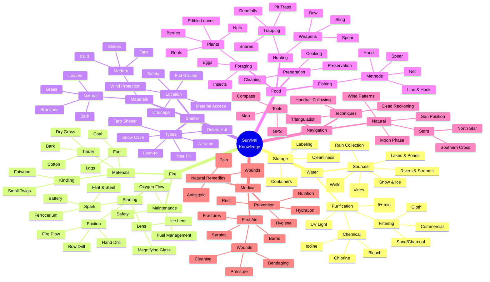
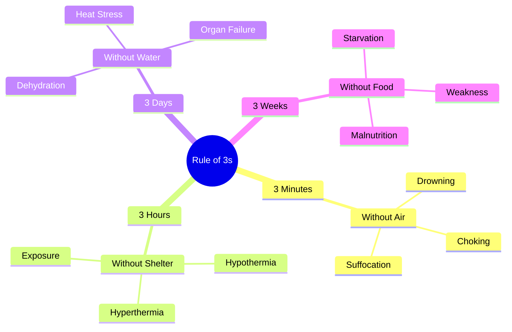
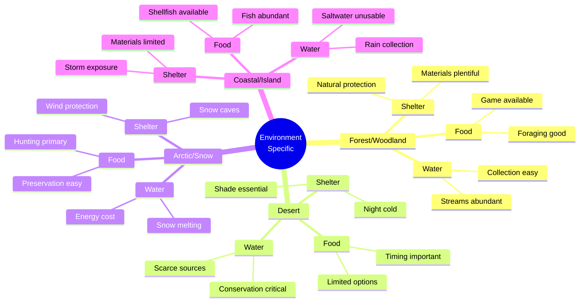
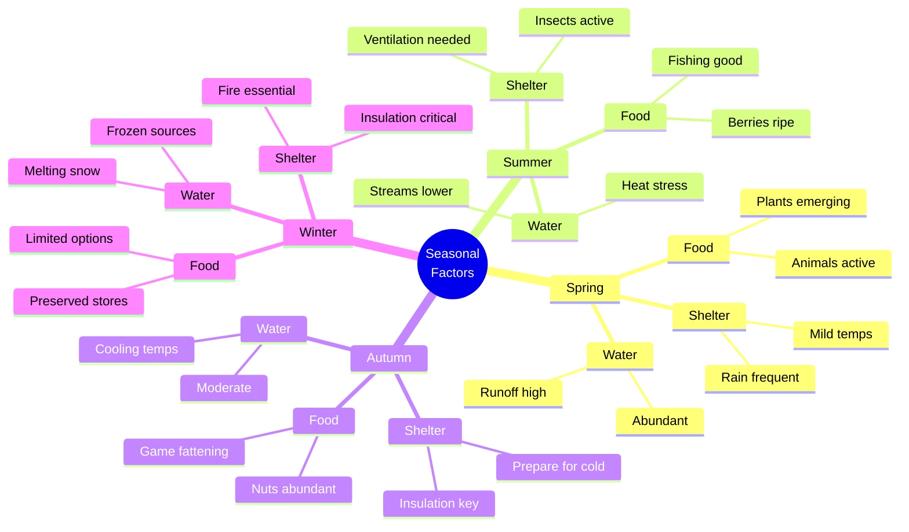

# Survival Knowledge Hierarchy

## Complete Knowledge Tree

## Core Skills Priority

## Regional Variations

## Seasonal Considerations

## Usage Notes

- Start from the center and work outward
- Each branch represents a knowledge domain
- Sub-branches show specific skills and techniques
- Cross-reference with knowledge bank guides for details
- Practice skills in safe environment before emergency
