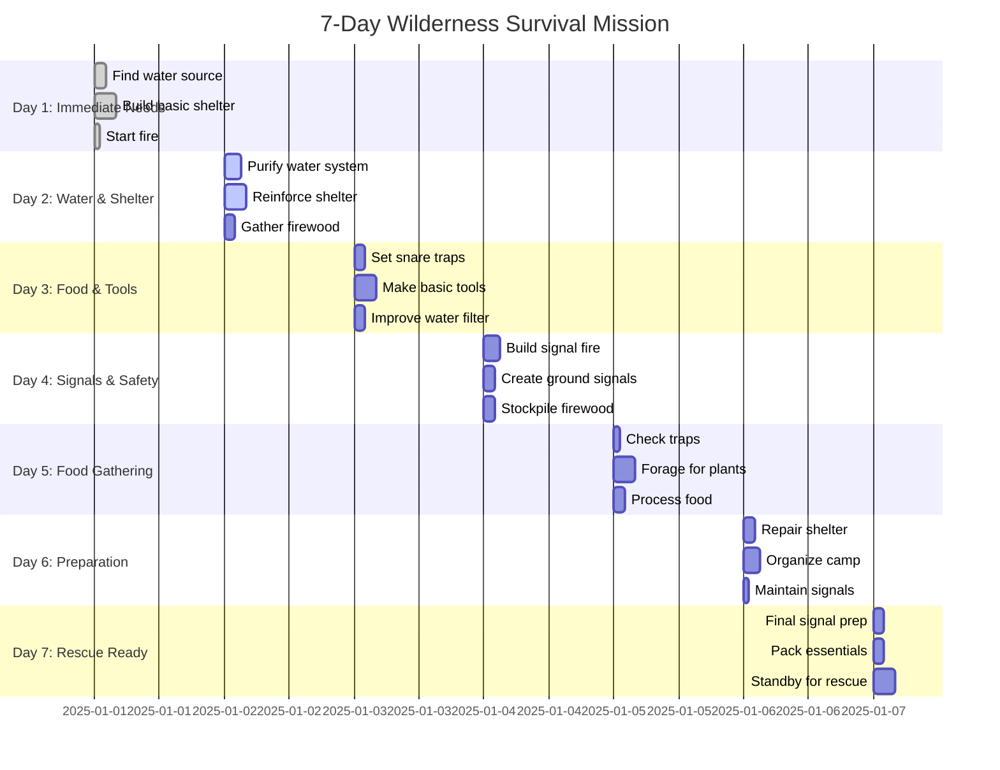
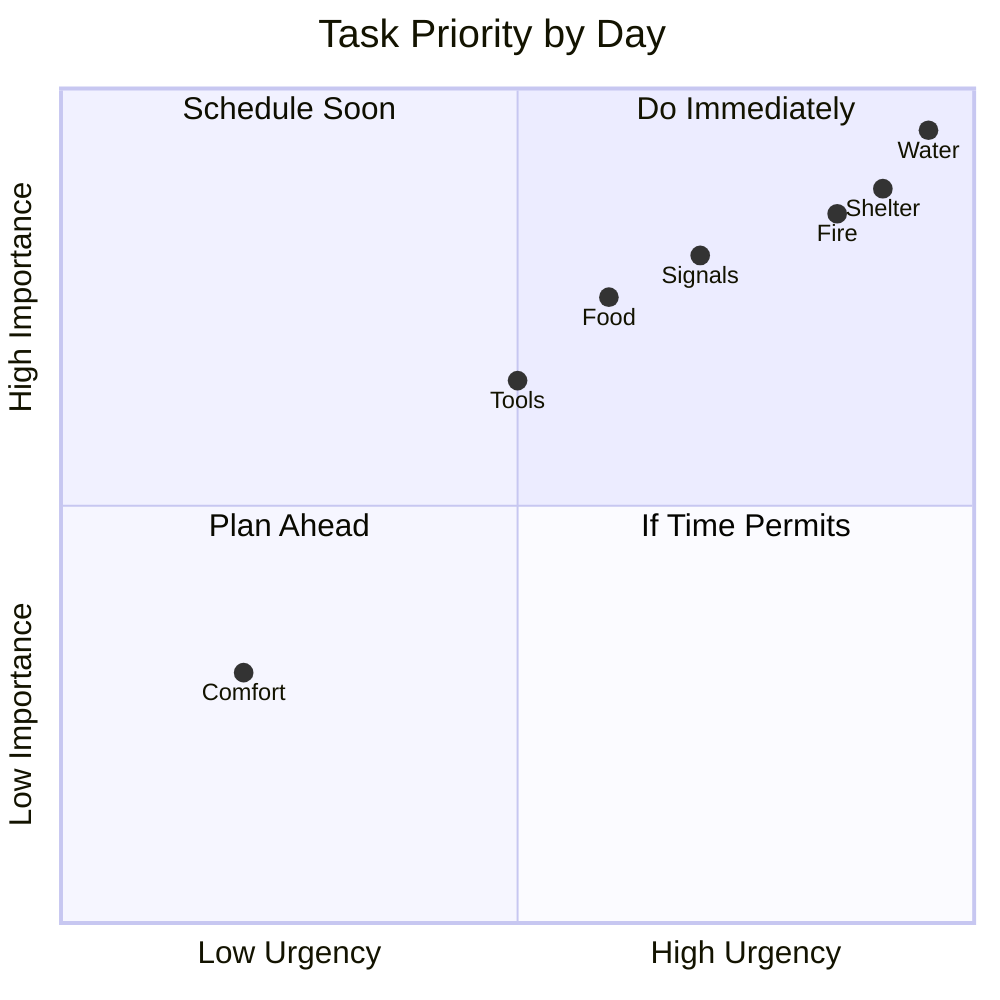
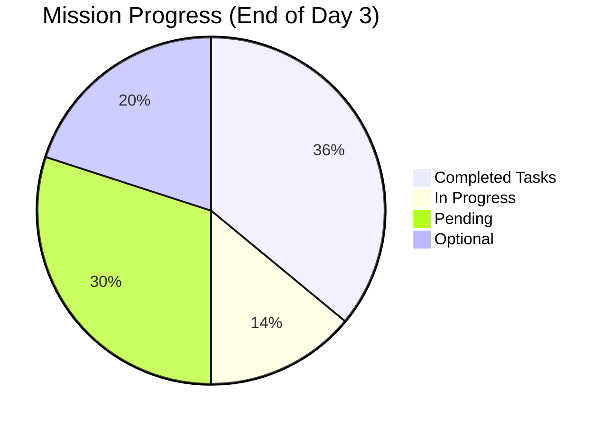

# 7-Day Survival Mission Timeline

## Mission Overview



## Daily Task Breakdown

```mermaid
gantt
    title Day 1 - Critical Setup
    dateFormat HH:mm

    section Water
    Find source          :done, 06:00, 2h
    Test quality         :done, 08:00, 30min
    Start purification   :done, 08:30, 1h

    section Shelter
    Select location      :done, 09:30, 30min
    Gather materials     :done, 10:00, 2h
    Build frame          :done, 12:00, 1h
    Add roof/walls       :done, 13:00, 2h

    section Fire
    Gather tinder        :done, 15:00, 30min
    Collect kindling     :done, 15:30, 30min
    Start fire           :done, 16:00, 30min
    Maintain             :done, 16:30, 1h

    section Rest
    Prepare evening meal :done, 17:30, 1h
    Security check       :done, 18:30, 30min
    Sleep preparation    :done, 19:00, 1h
```



## Resource Timeline

```mermaid
timeline
    title Resource Acquisition Timeline
    section Day 1-2: Basics
        Water : Locate and purify : 10 liters/day
        Shelter : Basic lean-to : Weather protection
        Fire : Continuous : Heat and signaling
    section Day 3-4: Expansion
        Food : Set traps : Check daily
        Tools : Knife : Spear : Containers
        Signals : Ground markers : Signal fire ready
    section Day 5-7: Maintenance
        Water : Established system : 15 liters/day
        Food : Foraging routes : Trap maintenance
        Signals : Active signaling : Rescue preparation
```

## Priority Quadrant



## Completion Status



## Notes

- **Day 1-2**: Focus on Rule of 3 - 3 hours without shelter, 3 days without water
- **Day 3-4**: Establish sustainable systems, don't exhaust yourself
- **Day 5-7**: Maintain what works, prepare for rescue
- **Daily**: Check water, fire, shelter, signals (WFSS)
