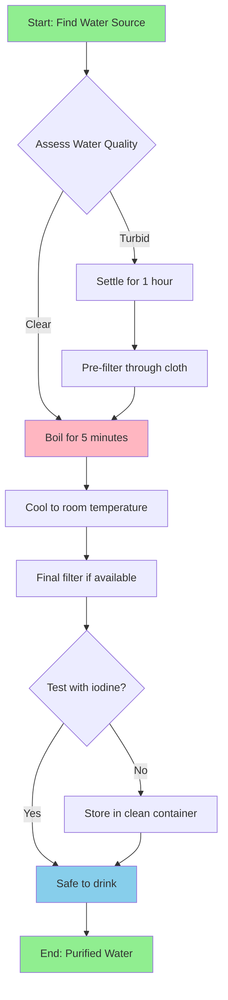
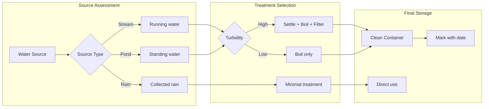
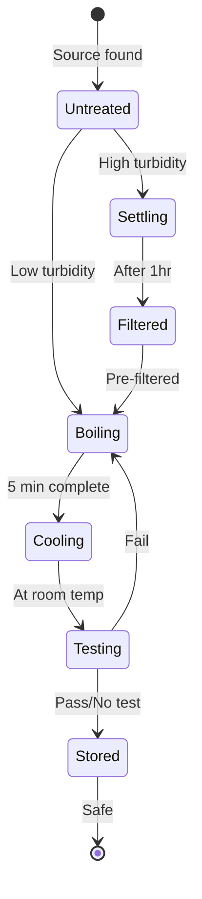

# Water Purification Process

## Overview Flowchart



## Detailed Decision Tree



## Timeline

```mermaid
timeline
    title Water Treatment Timeline
    section Finding
        00:00 : Locate water source
        00:15 : Assess quality and turbidity
    section Preparation
        00:20 : If turbid settle in container
        01:20 : Pre-filter through cloth
    section Treatment
        01:25 : Boil for 5 minutes minimum
        01:30 : Cool for 20 minutes
    section Storage
        01:50 : Filter through final filter
        01:55 : Store in clean marked container
        02:00 : Ready for consumption
```

## State Machine



## Usage Notes

- Always boil water for at least 5 minutes (longer at high altitude)
- Let turbid water settle before filtering to extend filter life
- Cool boiled water before filtering through plastic filters
- Store purified water in clean, marked containers
- Use within 24 hours if possible
